# [スマートファニチャー・プラットフォーム「カチャカ」](https://kachaka.life/) APIマニュアル

## 目次

- [用語](#用語)
- [IPアドレスとポート番号](#ipアドレスとポート番号)
- [カチャカAPIとは](#カチャカapiとは)
- [前提条件](#前提条件)
- [カチャカAPI仕様](#カチャカapi仕様)
- [利用開始の手順](#利用開始の手順)
- [サンプルコードをJupyterLabで実行する](#サンプルコードをjupyterlabで実行する)
  - [準備](#準備)
  - [パスワードの変更方法](#パスワードの変更方法)
  - [サンプルコードのダウンロード](#サンプルコードのダウンロード)
  - [サンプルコードの実行方法](#サンプルコードの実行方法)
- [カチャカAPIライブラリ](#カチャカapiライブラリ)
  - [使用方法](#使用方法)
  - [カチャカAPIライブラリのサンプルコード](#カチャカapiライブラリのサンプルコード)
- [gRPC](#grpc)
  - [PythonによるgRPCクライアント開発の準備（PCで行う場合）](#pythonによるgrpcクライアント開発の準備pcで行う場合)
  - [PythonによるgRPCクライアント開発の準備（カチャカにsshして行う場合）](#pythonによるgrpcクライアント開発の準備カチャカにsshして行う場合)
  - [gRPC サンプルコード一覧](#grpc-サンプルコード一覧)
  - [サンプルコードの実行方法](#サンプルコードの実行方法)
  - [Cursor の概念](#cursor-の概念)
- [ROS 2](#ros-2)
  - [ROS 2 Humbleのセットアップ](#ros-2-humbleのセットアップ)
  - [Dockerのセットアップ](#dockerのセットアップ)
  - [サンプルコードのダウンロード](#サンプルコードのダウンロード)
  - [kachaka\_interfaces, kachaka\_descriptionのビルド](#kachaka_interfaces-kachaka_descriptionのビルド)
  - [動作確認](#動作確認)
  - [サンプルコード](#サンプルコード)
- [Playground](#playground)
  - [Playgroundにsshでログインする](#playgroundにsshでログインする)
  - [Playgroundでサンプルプログラムを実行する](#playgroundでサンプルプログラムを実行する)
  - [自作ソフトの自動起動](#自作ソフトの自動起動)
  - [サンプルを自動起動する例](#サンプルを自動起動する例)
  - [Playgroundのリソース制限](#playgroundのリソース制限)
- [Web サンプル](#web)
  - [プロキシサーバ](#プロキシサーバ)
  - [Webサンプル(React + TypeScript)](#webサンプル-react--typescript)


## 用語

* Playground
    * カチャカ本体内で動くコンテナ環境。ユーザが自由にログインして自作のソフトウェアを実行できる。
* ros2_bridge
    * ros2のtopic, service, actionをカチャカとやり取りするサーバー


## IPアドレスとポート番号

* IPアドレス
    * カチャカのIPアドレス
        * スマートフォンアプリの「設定」→「アプリ情報」→「IPアドレス」に表示されます
    * Playground内部からgRPCを利用する場合のIPアドレス
        * 100.94.1.1
* ポート番号

<table>
  <tr>
   <td>ポート番号
   </td>
   <td>用途
   </td>
  </tr>
  <tr>
   <td>26400
   </td>
   <td>gRPC
   </td>
  </tr>
  <tr>
   <td>26500
   </td>
   <td>ssh
   </td>
  </tr>
  <tr>
   <td>26501
   </td>
   <td>JupyterLab
   </td>
  </tr>
  <tr>
   <td>26502~26509
   </td>
   <td>割り当てなし（自由利用可能）
   </td>
  </tr>
</table>

> **Note**
> IPアドレスが変わってしまい不便な場合は、ルータ等でカチャカのMACアドレスに対して固定IPアドレスを付与すると便利です。


## カチャカAPIとは

* カチャカはgRPCに準拠したAPIを備えており、ローカルネットワーク内、およびカチャカ本体のPlayground内から利用することが出来ます。
* サンプルとして提供されるカチャカAPIライブラリを使用する事により、gRPCを意識せずに簡単に使うことも可能です。
* また、ros2_bridgeを使用することにより、ROS 2からgRPCで提供されるサービスの一部を実行することが出来ます。


## 前提条件

* カチャカ本体内で動作するJupyterLabに関しては、ブラウザのみ用意すれば使用する事ができます。
  * 対応ブラウザについては、[JupyterLab公式ドキュメント](https://jupyterlab.readthedocs.io/en/stable/getting_started/installation.html#supported-browsers)をご確認ください。
* カチャカの外部から本書の手順に従ってカチャカAPIを使用する場合には、以下の条件に準拠したソフトウェアをインストールしたPCが必要となります。
    * OS
        *  Ubuntu 22.04 LTS
    * 開発言語
        * Python3.10
    * ROS 2（使用する場合）
        * ROS 2 Humble


## カチャカAPI仕様

* APIの詳細
    * [protos/kachaka-api.proto](protos/kachaka-api.proto)を参照してください。
* エラーコード
    * [docs/KachakaErrorCode.json](docs/KachakaErrorCode.json)
* カチャカを移動させるコマンドは、アプリの安全設定などに従い、障害物を検出して止まる事があります。
* ソフトウェアアップデート中はAPIを実行しないでください。


## 利用開始の手順

* スマートフォンアプリを以下の手順に従って操作し、カチャカAPIを有効にしてください。
    * 設定タブ → ロボットを選択 → 「カチャカAPI 」→ 「カチャカAPIを有効化する」をONにします。

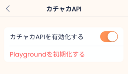

* 以下のダイアログが表示されるので、「利用規約」を確認の上、「カチャカAPI利用規約に同意する」をチェックして「設定する」を押して下さい。

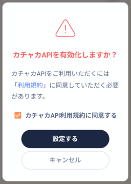

## サンプルコードをJupyterLabで実行する

* JupyterLabを使用してサンプルコードを実行する方法を説明します。


### 準備

* IPアドレスを確認します。
    * スマートフォンアプリの「設定」→「アプリ情報」→「IPアドレス」にカチャカのIPアドレスが記載されています。
* PCのブラウザを起動します。
* ブラウザで以下のURLにアクセスします。
    * http://&lt;カチャカのIPアドレス>:26501/
        * &lt;カチャカのIPアドレス>には、アプリで確認したIPアドレスが入ります。
* ログイン画面が表示されるので、以下のパスワードを入力してください。
    * パスワード：kachaka

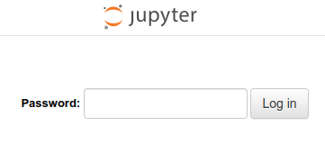

### パスワードの変更方法

* パスワードを変更する場合は、まずLauncherから「Terminal」を選択します。


* Terminalで、以下のコマンドを入力します。

```
jupyter lab password
Enter password: <新しいパスワード>
Verify password: <新しいパスワード>
```

* カチャカ本体を再起動すると、新しいパスワードが反映されます。

### サンプルコードのダウンロード

* 左側のファイル一覧から README.ipynb をダブルクリックしてください。
* 上部メニューの「▶▶」をクリックしてください。


* 以下のダイアログが表示された場合は「Restart」ボタンを押してください。


* サンプルコードのダウンロードが完了すると、以下のようなメッセージが表示され、左側のファイル一覧に kachaka-apiフォルダが作成されます。

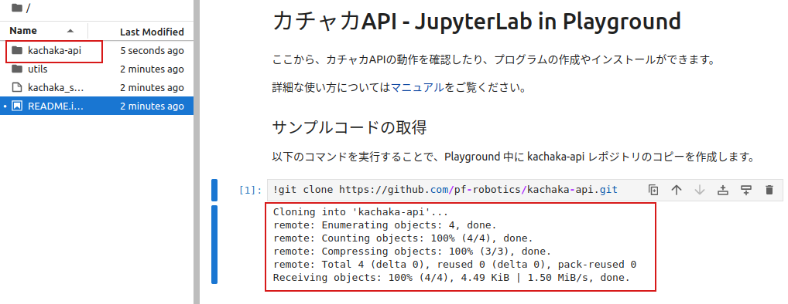

### 依存ライブラリのインストール

ダウンロード後初回の一回だけ、下記の手順を実行する必要があります。

* 左側のファイル一覧からkachaka-api → python → demosフォルダを選択します。
* install_libraries.ipynbをダブルクリックすると、右側にソースコードが表示されます。
* 上部メニューの「▶▶」ボタンを押して実行します。

### サンプルコードの実行方法

* 左側のファイル一覧からkachaka-api → python → demosフォルダを選択します。
* speak.ipynbをダブルクリックすると、右側にソースコードが表示されます。
* 上部メニューの「▶▶」ボタンを押して実行します。

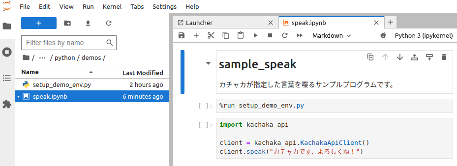

実行結果

「カチャカです、よろしくね」とカチャカが発話します。


## カチャカAPIライブラリ

* カチャカAPIライブラリは、gRPCを意識せずにPythonで開発を行うことができるライブラリです。
* 同期、非同期それぞれのライブラリがあります。


### 使用方法

[python/demos/kachaka_api_client.ipynb](python/demos/kachaka_api_client.ipynb) で各APIを動作させながら試すことができます。

### カチャカAPIライブラリのサンプルコード

* [sample_llm_speak.py](python/demos/sample_llm_speak.py) ... ChatGPT を使って、コマンド終了時にお喋りをするサンプル
* その他、[python/demos/](python/demos) 以下に、JupyterLab で利用できる Notebook 形式が多数あります

### 非同期ライブラリ

gRPCの呼び出しを非同期にしたライブラリも提供しています。必要に応じてご利用ください。  
同期ライブラリの機能に加えてcallback登録をサポートしています。  
callback機能については[sample_llm_speak.py](python/demos/sample_llm_speak.py)をご参照ください。  
使用方法を非同期版に書き換えたものはこちらです。[python/demos/kachaka_api_client_async.ipynb](python/demos/kachaka_api_client_async.ipynb)

## gRPC

* ここではPythonを用いてgRPCを使用する方法を説明します。
    * その他の言語については、以下の情報をご参照ください。
        * https://grpc.io/docs/


### PythonによるgRPCクライアント開発の準備（PCで行う場合）

* この章の説明はNotebookではなくPCのTerminalによる実行を想定しています。
* 以下のコマンドを実行し、サンプルコードをダウンロードします。

```
cd ~
git clone https://github.com/pf-robotics/kachaka-api.git
``` 

* 以下のコマンドを実行すると、gRPC の API 定義ファイルから gRPC を利用するのに必要なコードが生成されます。
  
```
cd ~
python3 -m venv venv
source venv/bin/activate

cd ~/kachaka-api/python/demos
pip install -r requirements.txt 

python -m grpc_tools.protoc -I../../protos --python_out=. --pyi_out=. --grpc_python_out=. ../../protos/kachaka-api.proto
```


### PythonによるgRPCクライアント開発の準備（カチャカにsshして行う場合）

* この章の説明はNotebookではなくTerminalによる実行を想定しています。カチャカにsshするか、JupyterLabのTerminal機能を利用してください。
    * sshの手順はPlaygroundの項目を参照してください。
* kachaka-api.protoファイルは予めPlaygoundにインストール済みですので、すぐに開発を始めることができます。
* サンプルコードは「サンプルコードをJupyterLabで実行する」の項目の手順を参考にダウンロードします。

### gRPC サンプルコード一覧

* [get_locations.py](python/demos/get_locations.py) ... 目的地一覧の取得
* [move_to_location.py](python/demos/move_to_location.py) ... 目的地への自律移動指令
* [set_auto_homing_enabled.py](python/demos/set_auto_homing_enabled.py) ... 自動で充電ドックに戻る機能のOn/Off
* [smart_speaker.py](python/demos/smart_speaker.py) ... スマートスピーカー連携（[マニュアル](python/demos/README_SMART_SPEAKER.md)）
* [time_signal.py](python/demos/time_signal.py) ... 1分間隔の時報

### gRPC サンプルコードの実行方法

* 目的地一覧を取得する(GetLocations)を実行する例
    * ソースコード: [python/demos/get_locations.py](python/demos/get_locations.py)

実行

* PCで実行する場合、以下のコマンドを実行します。
    * &lt;カチャカのIPアドレス>部分は、スマートフォンアプリに表示されるIPアドレスを入力します。

```
cd ~
source venv/bin/activate
cd ~/kachaka-api/python/demos
python get_locations.py <カチャカのIPアドレス>:26400
```

* Playground内から実行する場合、まずsshでPlaygroundにログインします。
    * ログイン後、以下のコマンドを実行します。
        * Playground内から実行する場合は、IPアドレスは100.94.1.1とします。

```
cd ~/kachaka-api/python/demos
python3 get_locations.py 100.94.1.1:26400
```

実行結果の例

スマートフォンアプリで登録済みの目的地が表示されます。

```
metadata {
  cursor: 1902856679949
}
locations {
  id: "L01"
  name: "ダイニング"
  pose {
    x: 1.33572
    y: 2.328592
  }
}
locations {
  id: "home"
  name: "充電ドック"
  pose {
    x: 0.136266
    y: -0.037587
    theta: 0.021679
  }
  type: LOCATION_TYPE_CHARGER
}
default_location_id: "L01"

```

### Cursor の概念

データを取得するAPIは、以下の目的のために、cursor による既読管理とロングポーリング([Wikipedia](https://ja.wikipedia.org/wiki/Push%E6%8A%80%E8%A1%93#Long_polling))を導入しています。

* クライアントが既に受け取ったデータを重複して受け取らない
* クライアント側で受け取れていないデータはサーバから再送される
* クライアント側の処理が滞った場合に、適切に古いデータが破棄され、最新のデータだけ送信される
* サーバ側でデータが生成されたタイミングで受信できる

サーバから既読管理に対応したデータを送信するとき、metadataのcursorにある数値を入れて送ります。クライアントはリクエスト時にmetadataのcursorに前回サーバから返答されたcursorを埋め込みます。サーバは送られてきたcursorが最新のcursorと違うときのみ最新のデータを送り、同じならば新しいデータが用意できるまで返答を遅延します。

起動直後などクライアントがデータを持っていない場合には、特殊なcursor(0)を送ることでサーバはその時点での最新のデータを返します。

常にリクエスト時の最新のデータが欲しい場合には、毎回cursor=0としてリクエストすれば良いです。

#### cursor を設定しない(0に設定する)ときの挙動

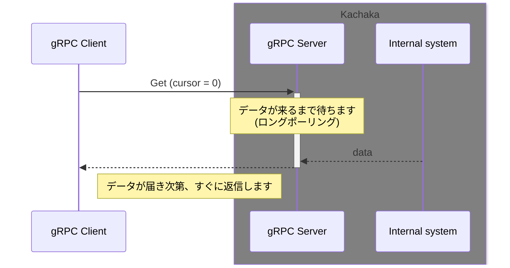

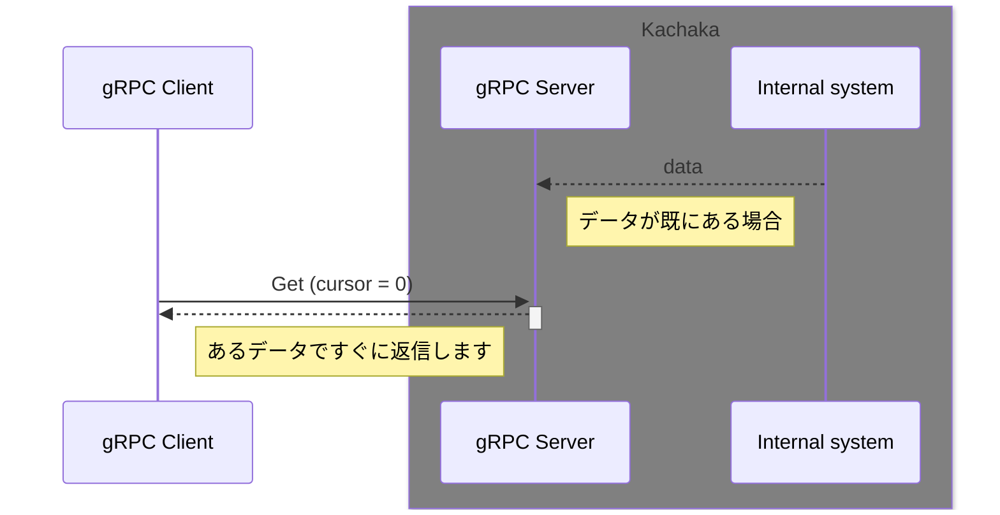

#### データの提供が高頻度で、全てを取得するのではなくて、最新のデータだけ欲しい場合

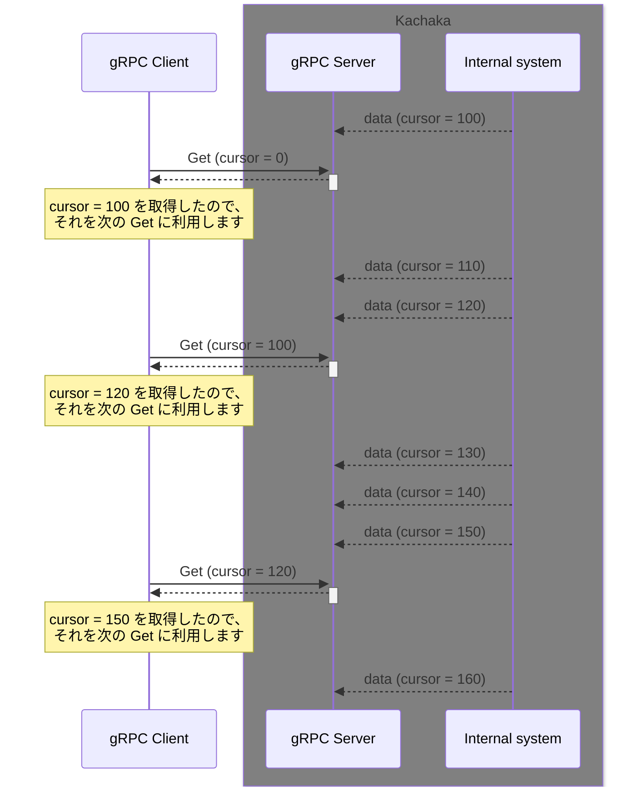

#### データがごくまれにしか更新されない場合

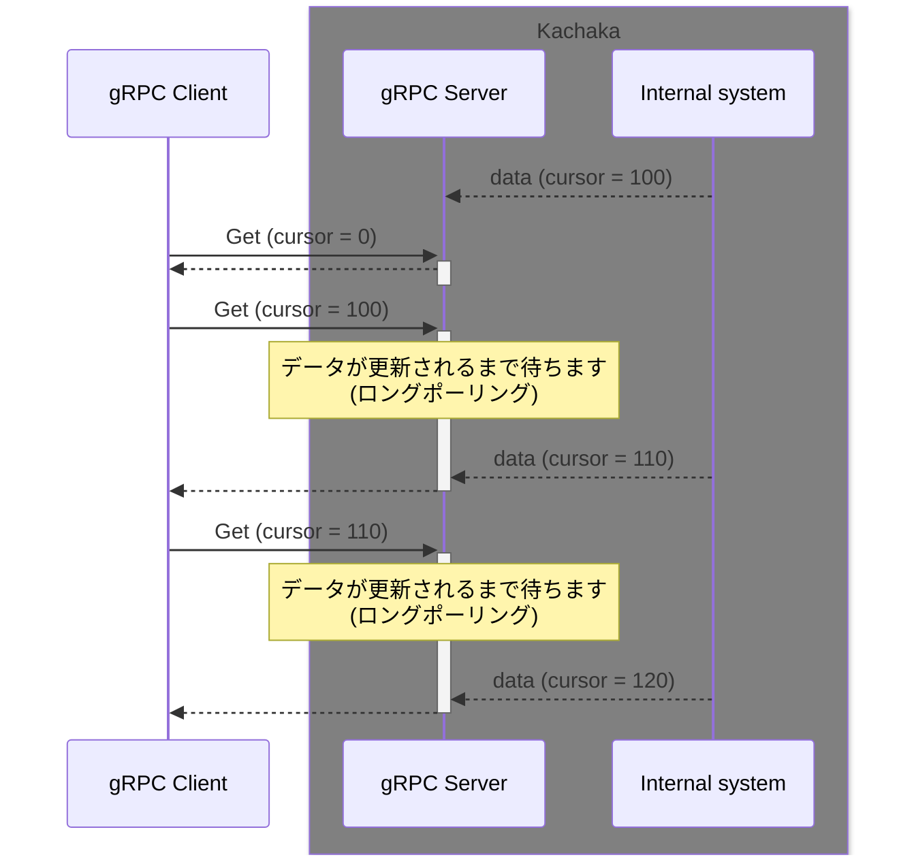

## ROS 2

### ROS 2 Humbleのセットアップ

* 以下を参考に、ROS 2 Humbleをセットアップして下さい。
    * https://docs.ros.org/en/humble/index.html

### Dockerのセットアップ

* 以下を参考に、Dockerの設定を行って下さい。
    * https://docs.docker.com/engine/install/ubuntu/


### サンプルコードのダウンロード

```
cd ~
git clone https://github.com/pf-robotics/kachaka-api.git
```

### kachaka_interfaces, kachaka_descriptionのビルド 

* 以下の手順でビルドします。

```
mkdir -p ~/ros2_ws/src
cd ~/ros2_ws/src
ln -s ~/kachaka-api/ros2/kachaka_interfaces/ kachaka_interfaces
ln -s ~/kachaka-api/ros2/kachaka_description/ kachaka_description

cd ~/ros2_ws
colcon build
```

### 動作確認

* ros2_bridgeの起動
    * 別のターミナルで以下を実行してください。
    * 初回実行時に、Dockerイメージがダウンロードされます。
        * イメージの提供は予告なく停止される場合があります。

```
cd ~/kachaka-api/tools/ros2_bridge
./start_bridge.sh <カチャカのIPアドレス>
```

* ros2コマンドによる動作確認
    * 以下のコマンドを実行すると、topic一覧が表示されます

```
cd ~/ros2_ws
source install/setup.bash
ros2 topic list
```

* 目的地一覧を取得する例

```
cd ~/ros2_ws
source install/setup.bash
ros2 topic echo /kachaka/layout/locations/list
```

目的地一覧の例

```
locations:
- id: L01
  name: ダイニング
  type: 0
  pose:
    x: 1.33572
    y: 2.328592
    theta: 0.0
```


* rviz2による可視化

```
cd ~/ros2_ws
source install/setup.bash
cd src/kachaka_description/config
rviz2 -d kachaka.rviz
```

### サンプルコード

* サンプルコードは以下の場所にあります
    * [ros2/demos](ros2/demos)
* サンプルコードの実行方法
    * サンプルコードのREADME.mdの手順を実行してください


## Playground

* カチャカ本体の資源の一部（Playground）を開発者が使用する事が出来ます。
* 以下にログイン方法や、便利な使い方の説明をします。


### Playgroundにsshでログインする

* jupyterlabのterminalもしくは下記のnotebookいずれかを用いて公開鍵の設定を行います
    * utils/set_authorized_keys.ipynb
    * utils/set_authorized_keys_from_github.ipynb
        * githubに登録している鍵をカチャカでも利用したい場合、こちらのスクリプトが便利です
* utils/set_authorized_keys.ipynbを使用した設定方法
    * 画面左上のFile Browserを選択します。
    * 画面左のファイル一覧からutils → set_authorized_keys.ipynbをダブルクリックします。
    * 画面中央のpublic_keysに公開鍵のテキストを貼り付けます。
    * 上部メニューの「▶▶」ボタンを押します。

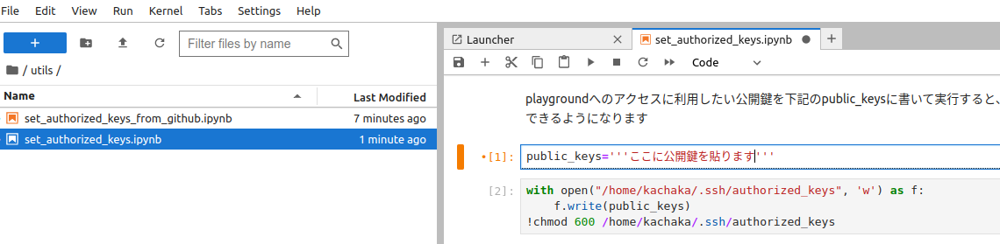

* utils/set_authorized_keys_from_github.ipynbを使用した設定方法
    * 画面左上のFile Browserを選択します。
    * 画面左のファイル一覧からutils → set_authorized_keys_from_github.ipynbをダブルクリックします。
    * 画面中央のuserにgithubのユーザ名を入力します。
    * 上部メニューの「▶▶」ボタンを押します

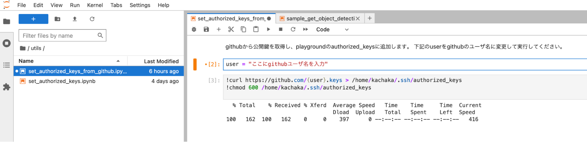

以下のコマンドを実行してPlaygroundにログインします

```
ssh -p 26500 -i <登録した公開鍵に対応する秘密鍵> kachaka@<kachakaのIPアドレス>
```

### Playgroundでサンプルプログラムを実行する

* カチャカにsshでログインします。
* 以下のコマンドを実行すると、カチャカが時報を1分間隔で発話します。

```
cd ~
git clone https://github.com/pf-robotics/kachaka-api.git
pip install -r /home/kachaka/kachaka-api/python/demos/requirements.txt
python3 /home/kachaka/kachaka-api/python/demos/time_signal.py 100.94.1.1:26400
```

### 自作ソフトの自動起動

* /home/kachaka/kachaka_startup.sh に自動起動したい処理を記述してください。
* カチャカ起動時に自動的に実行されます
* ログが /tmp/kachaka_startup.log に記録されます
    * python3 を自動起動する際は `-u` オプションを付けると良いです。そうでないと標準出力がバッファリングされてしまい、ログが確認できないことがあります。

### サンプルを自動起動する例

* /home/kachaka/kachaka_startup.sh を以下のように編集します。
```
#!/bin/bash

jupyter-lab --port=26501 --ip='0.0.0.0' &

# 以下の行を追加します
python3 -u /home/kachaka/kachaka-api/python/demos/time_signal.py 100.94.1.1:26400 &
```

* 保存後、カチャカを再起動します。再起動後、暫くすると、1分間隔で現在時刻を発話します。


### Playgroundのリソース制限

* ストレージ総計(/home, tmp) 3GB
* メモリー 512MB

## Web

* ブラウザで動作するwebアプリからも、カチャカAPIを利用することができます。
* ただし、webアプリからの通信は現状grpc-webのプロトコルに則る必要があり、これを仲介してくれるプロキシサーバーを立てる必要があります。
  * gRPCの通信に必要なHTTP/2の通信をjavascriptから自由に取り扱うことが可能な環境は限られており、HTTP/1.1で表現するgrpc-webプロトコルが必要です。
* ここでは、プロキシをenvoyを使って立てる方法を紹介し、webアプリからカチャカAPIを利用するサンプルをご紹介します。

### プロキシサーバ

* プロキシサーバーの起動
```
$ ./tools/web_proxy/start_proxy_remote.sh <カチャカのIPアドレス>
```

* プロキシサーバーは、webアプリからアクセスでき、またカチャカにアクセスできるネットワーク接続を備えた場所であればどこで起動しても構いません。
* このスクリプトでは、`localhost:50000`にプロキシサーバを立てる例を示しています。

### Webサンプル (React + TypeScript)

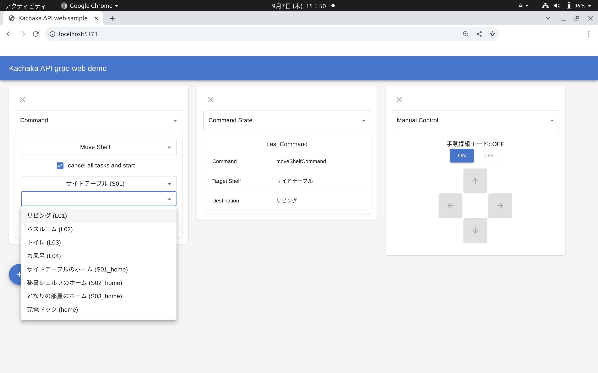

* Reactを利用して、カチャカAPIと連携するwebアプリのサンプルです。
* プラスボタンを押すとパネルが追加され、パネルの種類を選ぶと対応するAPIを利用した表示がなされるデモです。
* 起動するには、以下のコマンドを実行してください。
```
$ cd web/demos/kachaka_api_web_sample
$ npm install
$ npm run dev
```

* npmの環境がない方は、適宜インストール作業を行って下さい。
* 以下にインストール方法の例を示します。
  * aptでインストールされるnpmは古い可能性があります。nで最新のstableをインストールすることを推奨します。
  * サンプルは nodejs v18.17.1、npm 9.6.7 で動作を確認しています。
```
$ sudo apt install nodejs npm
$ sudo npm install -g n
$ sudo n stable
```

#### カチャカAPIとReact hook
* [Cursor の概念](#cursor-の概念)で紹介したとおり、カチャカAPIではcursorという概念を用いることで、無駄のない値の更新を行っています。
* React hookでは、このカーソルの更新をつかってGet系のAPIを呼び出し、レスポンスが返ってくるたびにstateを更新することで、値が変更されるたびに最低限の計算でレンダリングを行うことができます。
* 具体的な処理については `web/demos/kachaka_api_web_sample/src/kachakaApi.ts` を参照してください。

## License
Copyright 2023 Preferred Robotics, Inc.
Licensed under [the Apache License, Version 2.0](LICENSE).
