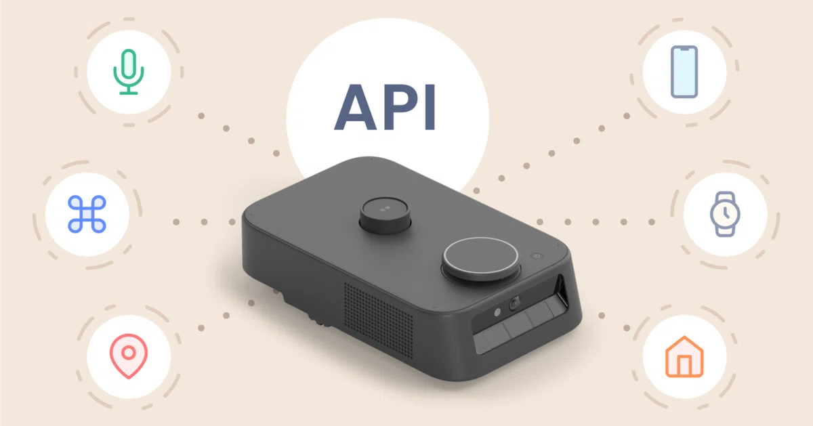
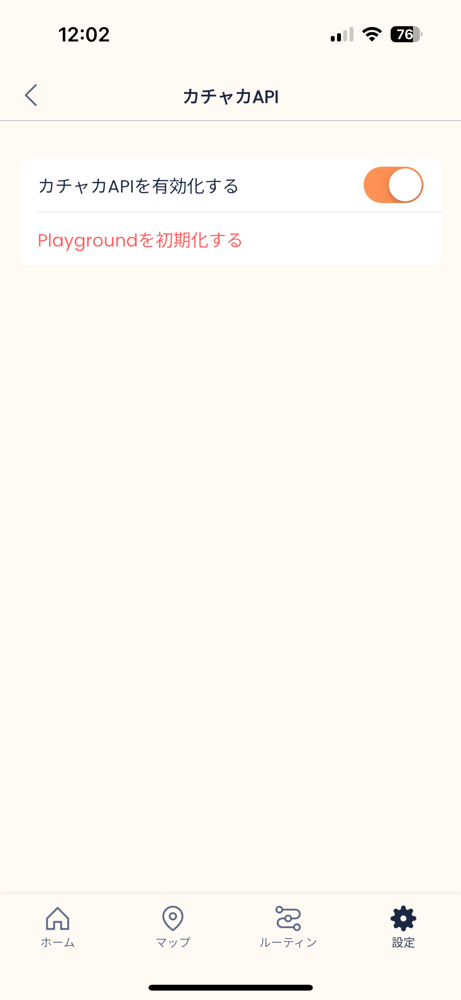
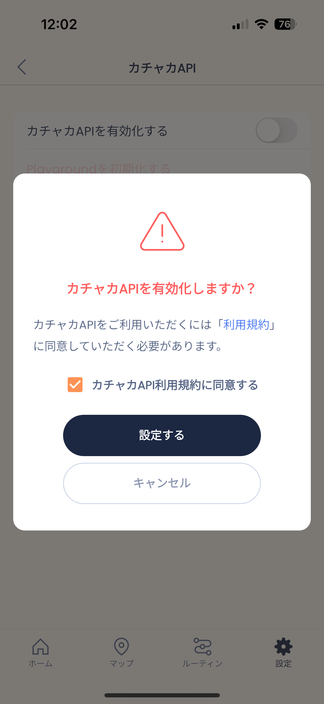
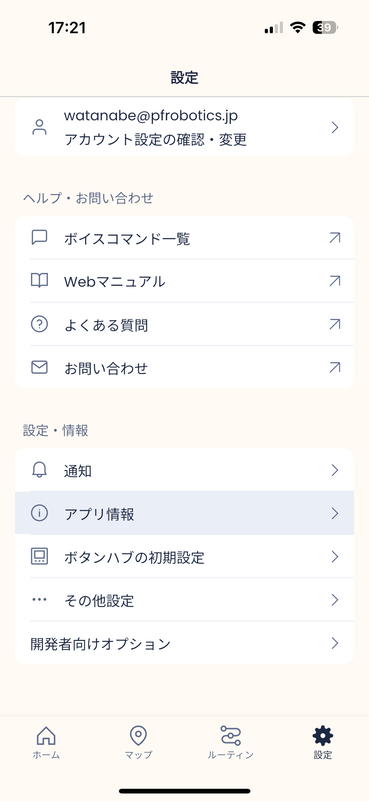
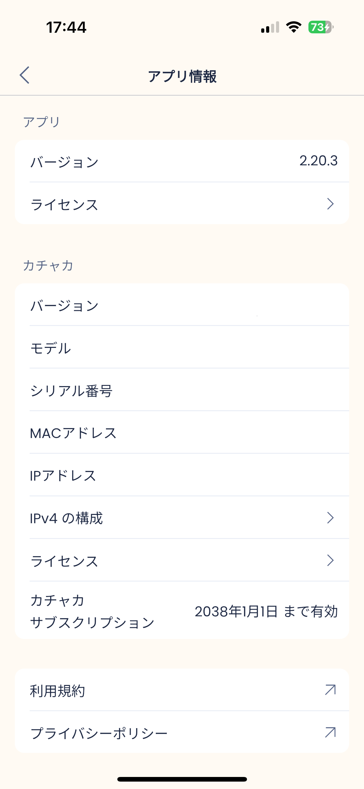

  
  
  

##

[スマートファニチャー・プラットフォーム「カチャカ」](https://kachaka.life/) のAPIを提供するリポジトリです。

カチャカAPIは、カチャカのドッキングや移動を制御したり、カチャカの状態やセンサー値を取得したりするための機能を提供します。

* ローカルネットワーク内の機器、あるいはカチャカ体内にあるユーザー環境(Playground)からのアクセスが可能です。
* この公式リポジトリでは、PythonやROS 2で簡単にカチャカAPIを利用できるSDKを提供しています。

* カチャカAPIで利用可能な機能一覧については、「[カチャカAPIでできること](./docs/FEATURES.md)」をご覧ください。

### 公式で提供するSDK

* 🐍 Python 3.10+
* 🤖 ROS 2 Humble (Ubuntu 22.04 LTS)

### その他の言語
カチャカAPIは[gRPC](https://grpc.io/)を使用した通信インターフェースとして提供されています。
これ以外の言語でも、gRPCを直接利用してアクセスすることが可能です。

## はじめに
### カチャカAPIの有効化
> [!IMPORTANT]
> どんな使い方をする場合でも、まずはじめにスマートフォンアプリを使ってカチャカAPIを有効にする必要があります。

* カチャカに接続し、[⚙設定]のタブから接続するロボットを選択、[カチャカAPI]ページを開いて「カチャカAPIを有効化する」をONにします。
* ダイアログが表示されるので、「利用規約」を確認の上、「カチャカAPI利用規約に同意する」をチェックして「設定する」を押して下さい。

<table>
<tr>
<td></td>
<td></td>
</tr>
</table>

### カチャカのIPアドレスの確認
* またいずれの場合にも、カチャカのIPアドレスが必要になります。
* [⚙設定] > [アプリ情報] から確認することができます。(以下のキャプチャは白塗りしてあります)
* また、mDNSによる名前解決に対応しており、同画面の「シリアル番号」からなる
    * `kachaka-<シリアル番号>.local`というホスト名でもアクセス可能です。

<table>
<tr>
<td></td>
<td></td>
</tr>
</table>

## カチャカAPIマニュアル

* 📖 [カチャカAPIでできること](./docs/FEATURES.md)
    * カチャカAPIでできることをまとめています。
* 🚀 [カチャカAPIを簡単に試してみる (JupyterLab)](./docs/QUICKSTART.md)
    * Webブラウザから、JupyterLabを使ってカチャカAPIを利用する方法を説明します。
    * OS環境を問わず広く利用できるため、カチャカAPIの動作確認やサンプルコードの実行におすすめです。
* 🐍 [PythonでカチャカAPIを利用する](./docs/PYTHON.md)
    * PythonでカチャカAPIを利用する方法を説明します。
* 🤖 [ROS 2でカチャカAPIを利用する](./docs/ROS2.md)
    * ROS 2でカチャカAPIを利用する方法を説明します。
* 🏠 [カチャカ体内 (Playground) で自作のプログラムを動かす](./docs/PLAYGROUND.md)
    * カチャカ内部には、Playgroundというユーザー用の環境があります。
    * 外部機器を用意せずとも、カチャカ体内で自作のプログラムを動かすことが可能です。
* 🌐 [PythonやROS2以外の言語でカチャカAPIを利用する](./docs/GRPC.md)
    * PythonやROS2以外の言語でカチャカAPIを利用する方法を説明します。
* 💻 [WebアプリでカチャカAPIを利用する](./docs/WEB.md)
    * WebアプリでカチャカAPIを利用する方法を説明します。

## 💬 要望・バグ報告・コントリビューション

* カチャカAPIはOSSとして公開されています。要望やバグ報告など大歓迎です。[コントリビューションガイドライン](./CONTRIBUTING.md)をご覧ください。
* 質問や要望などは、[GitHub Discussions](https://github.com/pf-robotics/kachaka-api/discussions) からお願いします。

## License
Copyright 2023 Preferred Robotics, Inc.
Licensed under [the Apache License, Version 2.0](LICENSE).
