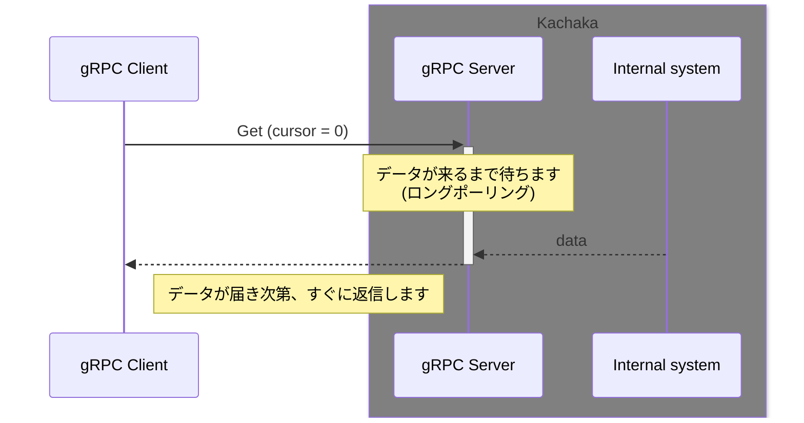
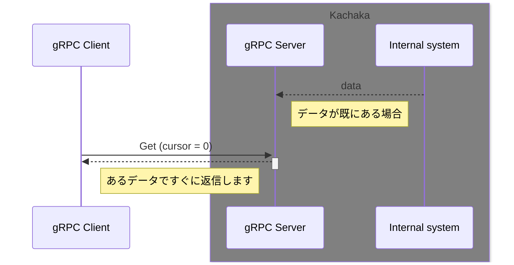
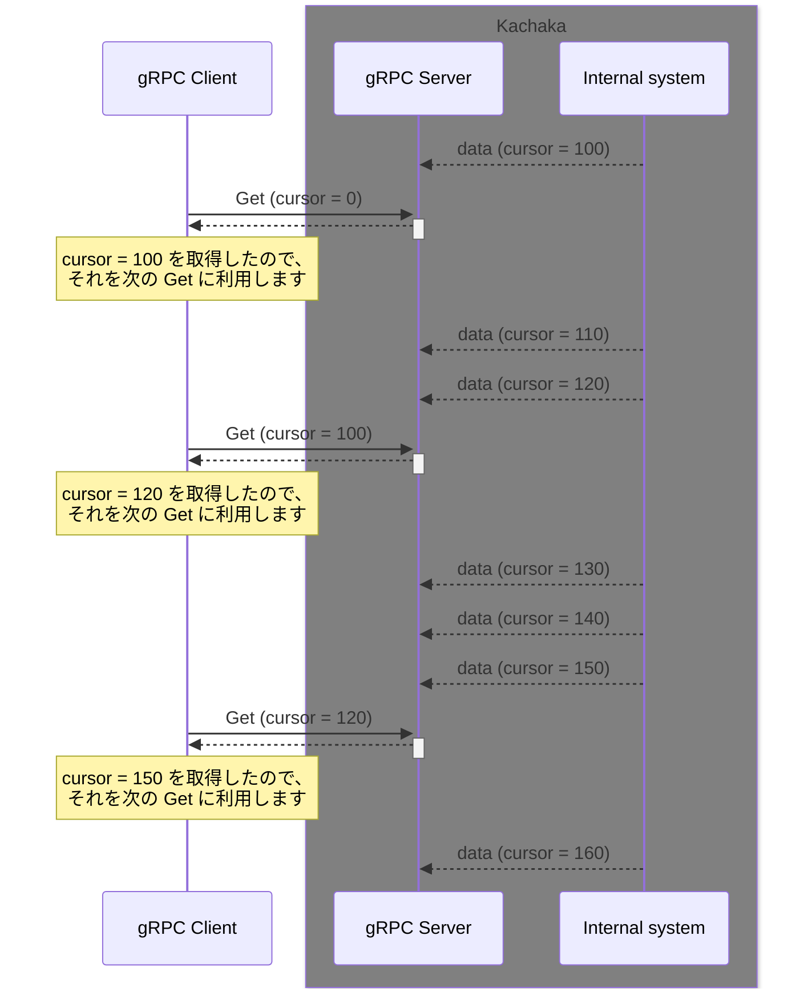
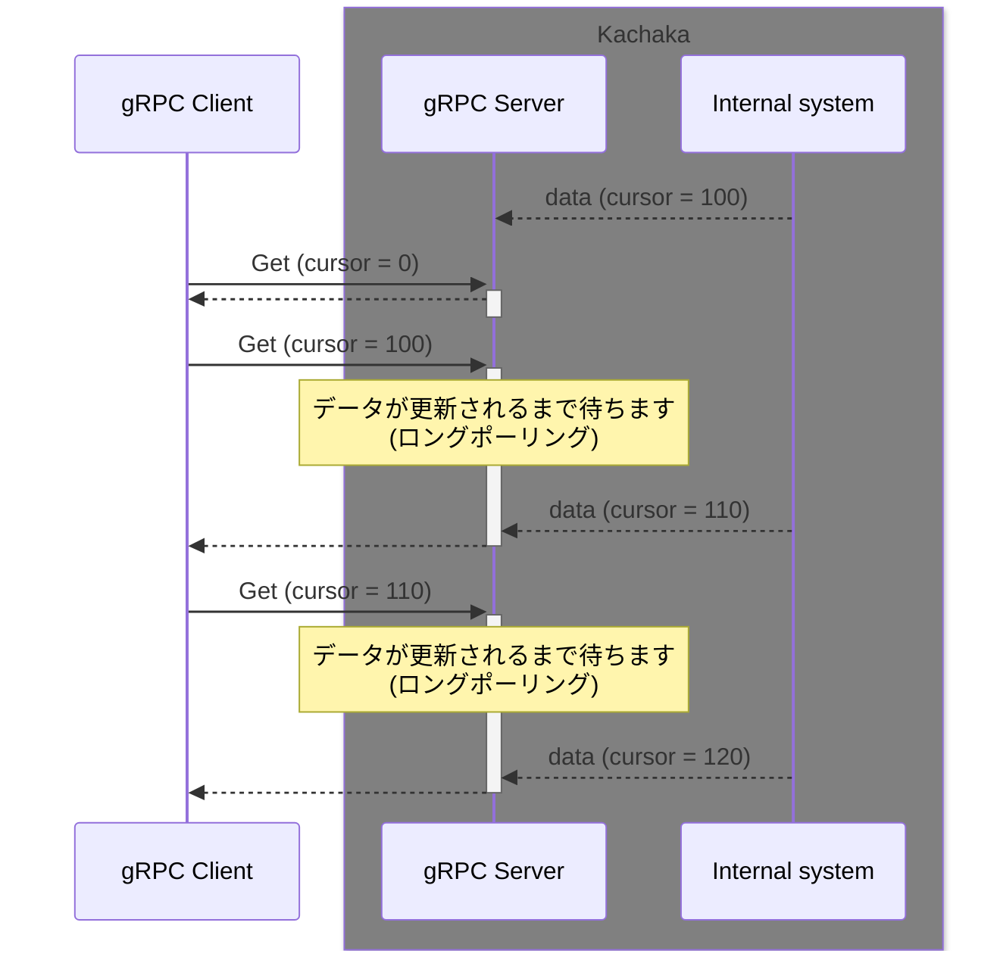

# gRPC

* ここではPythonを用いてgRPCを使用する方法を説明します。
    * その他の言語については、以下の情報をご参照ください。
        * https://grpc.io/docs/

## 目次
- [PythonによるgRPCクライアント開発の準備（PCで行う場合）](#pythonによるgrpcクライアント開発の準備pcで行う場合)
- [PythonによるgRPCクライアント開発の準備（カチャカにsshして行う場合）](#pythonによるgrpcクライアント開発の準備カチャカにsshして行う場合)
- [gRPC サンプルコード一覧](#grpc-サンプルコード一覧)
- [サンプルコードの実行方法](#サンプルコードの実行方法)
- [Cursor の概念](#cursor-の概念)


## PythonによるgRPCクライアント開発の準備（PCで行う場合）

* この章の説明はNotebookではなくPCのTerminalによる実行を想定しています。
* 以下のコマンドを実行し、サンプルコードをダウンロードします。

```
cd ~
git clone https://github.com/pf-robotics/kachaka-api.git
``` 

* 以下のコマンドを実行すると、gRPC の API 定義ファイルから gRPC を利用するのに必要なコードが生成されます。
  
```
cd ~
python3 -m venv venv
source venv/bin/activate

cd ~/kachaka-api/python/demos
pip install -r requirements.txt 

python -m grpc_tools.protoc -I../../protos --python_out=. --pyi_out=. --grpc_python_out=. ../../protos/kachaka-api.proto
```


### PythonによるgRPCクライアント開発の準備（カチャカにsshして行う場合）

* この章の説明はNotebookではなくTerminalによる実行を想定しています。カチャカにsshするか、JupyterLabのTerminal機能を利用してください。
    * sshの手順はPlaygroundの項目を参照してください。
* kachaka-api.protoファイルは予めPlaygoundにインストール済みですので、すぐに開発を始めることができます。
* サンプルコードは「サンプルコードをJupyterLabで実行する」の項目の手順を参考にダウンロードします。

### gRPC サンプルコード一覧

[python/demos/grpc_samples](python/demos/grpc_samples) にgrpcを利用したサンプルコードがあります。

### gRPC サンプルコードの実行方法

* 目的地一覧を取得する(GetLocations)を実行する例
    * ソースコード: [python/demos/grpc_samples/get_locations.py](python/demos/grpc_samples/get_locations.py)

実行

* PCで実行する場合、以下のコマンドを実行します。
    * &lt;カチャカのIPアドレス>部分は、スマートフォンアプリに表示されるIPアドレスを入力します。

```
cd ~
source venv/bin/activate
cd ~/kachaka-api/python/demos/grpc_samples
python get_locations.py <カチャカのIPアドレス>:26400
```

* Playground内から実行する場合、まずsshでPlaygroundにログインします。
    * ログイン後、以下のコマンドを実行します。
        * Playground内から実行する場合は、IPアドレスは100.94.1.1とします。

```
cd ~/kachaka-api/python/demos/grpc_samples
python3 get_locations.py 100.94.1.1:26400
```

実行結果の例

スマートフォンアプリで登録済みの目的地が表示されます。

```
metadata {
  cursor: 1902856679949
}
locations {
  id: "L01"
  name: "ダイニング"
  pose {
    x: 1.33572
    y: 2.328592
  }
}
locations {
  id: "home"
  name: "充電ドック"
  pose {
    x: 0.136266
    y: -0.037587
    theta: 0.021679
  }
  type: LOCATION_TYPE_CHARGER
}
default_location_id: "L01"

```

### Cursor の概念

データを取得するAPIは、以下の目的のために、cursor による既読管理とロングポーリング([Wikipedia](https://ja.wikipedia.org/wiki/Push%E6%8A%80%E8%A1%93#Long_polling))を導入しています。

* クライアントが既に受け取ったデータを重複して受け取らない
* クライアント側で受け取れていないデータはサーバから再送される
* クライアント側の処理が滞った場合に、適切に古いデータが破棄され、最新のデータだけ送信される
* サーバ側でデータが生成されたタイミングで受信できる

サーバから既読管理に対応したデータを送信するとき、metadataのcursorにある数値を入れて送ります。クライアントはリクエスト時にmetadataのcursorに前回サーバから返答されたcursorを埋め込みます。サーバは送られてきたcursorが最新のcursorと違うときのみ最新のデータを送り、同じならば新しいデータが用意できるまで返答を遅延します。

起動直後などクライアントがデータを持っていない場合には、特殊なcursor(0)を送ることでサーバはその時点での最新のデータを返します。

常にリクエスト時の最新のデータが欲しい場合には、毎回cursor=0としてリクエストすれば良いです。

#### cursor を設定しない(0に設定する)ときの挙動





#### データの提供が高頻度で、全てを取得するのではなくて、最新のデータだけ欲しい場合



#### データがごくまれにしか更新されない場合


