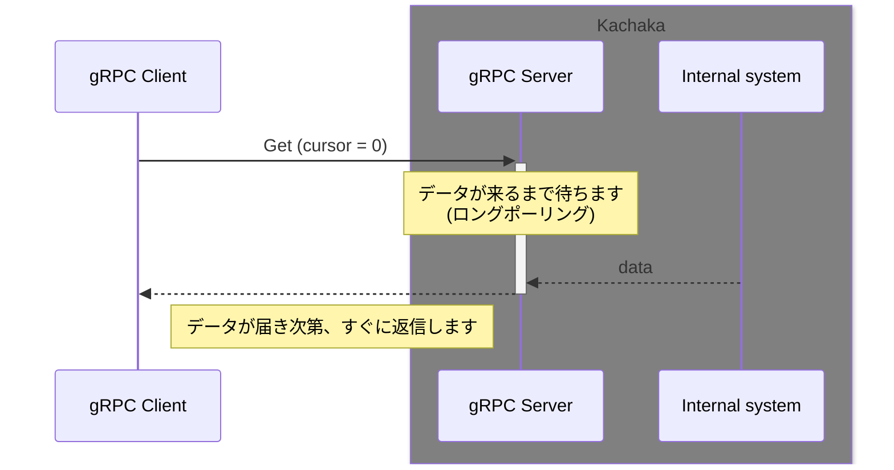
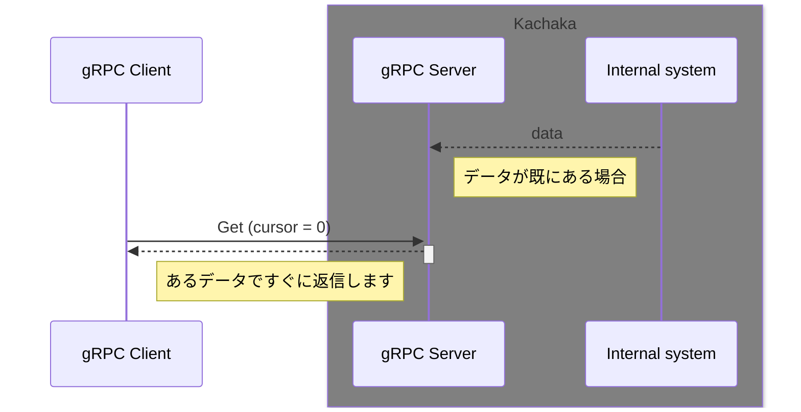
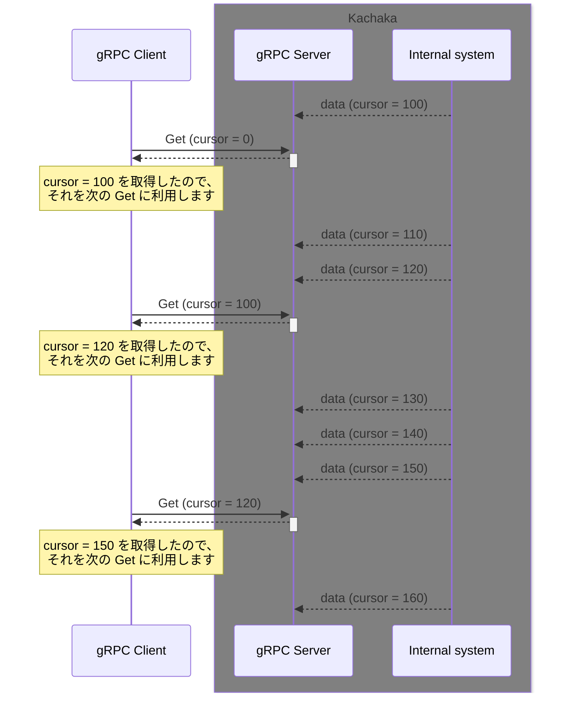
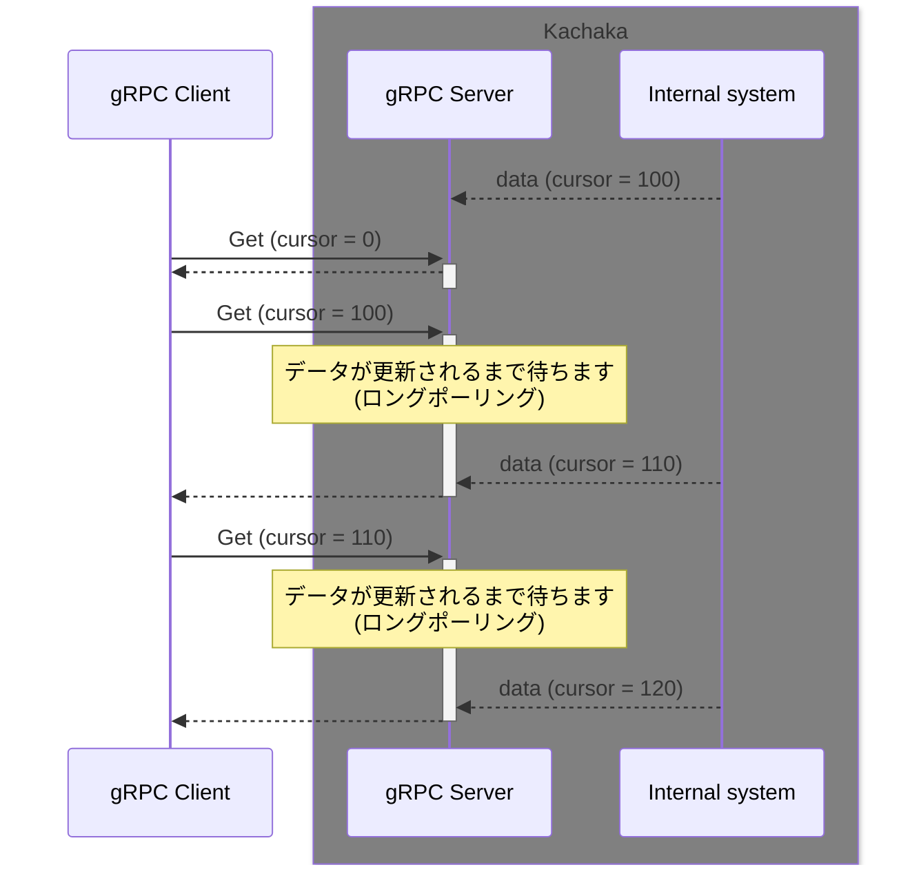

# PythonやROS2以外の言語でカチャカAPIを利用する

このリポジトリではPythonとROS 2のみをサポートしていますが、これ以外の言語や環境からもカチャカAPIを利用することが可能です。
カチャカAPIはあくまでgRPCによる通信インターフェースとして提供されているため、通信規格に準拠したクライアントさえ用意できれば、どんな環境からでも利用できます。

ここでは、Pythonを例に自分でgRPCクライアントを開発する方法について説明します。
その他の言語については、[gRPC公式ドキュメント](https://grpc.io/docs/) を参照しながら、同様の方法でクライアントを開発してください。コントリビューションもお待ちしております。

## 目次
- [gRPCとは](#grpcとは)
- [PythonでgRPCクライアントを開発する](#pythonでgrpcクライアントを開発する)
- [gRPC サンプルコード一覧](#grpc-サンプルコード一覧)
  - [gRPC サンプルコードの実行方法](#grpc-サンプルコードの実行方法)
- [Cursorによるロングポーリング](#cursorによるロングポーリング)

## gRPCとは

gRPCは、Googleによって開発されたRPCフレームワークです。
RPCは、リモートプロシージャコール(Remote Procedure Call)の略で、カチャカの体内にある関数(API)を、ネットワーク越しに呼び出すようなイメージです。

### メッセージ定義とrpc定義
gRPCは、データのシリアライズにはProtocol Buffersを利用しており、rpcの定義もProtocol Buffersの定義ファイルであるprotoを拡張する形で行えるようになっています。
カチャカAPIのメッセージ定義とrpc定義も、[kachaka-api.proto](../protos/kachaka-api.proto) に記述されています。


## PythonでgRPCクライアントを開発する

* では、実際にgRPCを使ったカチャカAPIの利用を、Pythonで行ってみましょう。
  * Pythonのkachaka_apiライブラリは、これをライブラリとしてまとめたものです。

### protoファイルからのコード生成
* gRPCでは、protoファイルから自分が使う言語向けのコードを自動で生成して使います。
  * つまり、protoで定義されているようなメッセージ型やrpc定義を、自分の言語で使えるようにしてくれるわけです。
* 以下のコマンドを実行し、サンプルコードをダウンロードします。

```bash
cd ~
git clone https://github.com/pf-robotics/kachaka-api.git
``` 

* 以下のコマンドを実行すると、protoファイルから gRPC を利用するのに必要なコードが生成されます。
  
```bash
mkdir -p ~/kachaka_grpc_client
cd ~/kachaka_grpc_client
python3 -m venv venv
source venv/bin/activate

pushd ~/kachaka-api/python/demos
pip install -r requirements.txt 
popd

python -m grpc_tools.protoc -I ~/kachaka-api/protos --python_out=. --pyi_out=. --grpc_python_out=. ~/kachaka-api/protos/kachaka-api.proto
```

* これで、`~/kachaka_grpc_client/kachaka_pb2.py` と `~/kachaka_grpc_client/kachaka_pb2_grpc.py` が生成されます。
  * これらのファイルは、カチャカAPIのメッセージ型やrpc定義をPythonで利用するためのコードです。
  * これらのファイルを利用して、カチャカAPIを利用するクライアントを作成します。

```python
import grpc
import kachaka_api_pb2
import schedule
from kachaka_api_pb2_grpc import KachakaApiStub

# カチャカのIPアドレスを指定して、gRPCクライアントを作成します。
stub = KachakaApiStub(grpc.insecure_channel("192.168.0.20:26400"))


def main() -> None:
    # カチャカに発話するコマンドを実行させてみます
    req = kachaka_api_pb2.StartCommandRequest(
        command=kachaka_api_pb2.Command(
            speak_command=kachaka_api_pb2.SpeakCommand(text="こんにちは、カチャカです")
        )
    )

    response = stub.StartCommand(req)
    if not response.result.success:
        print("Sending speak command failed: " + response.result.error_code)
        return
    print("Speak command sent")

if __name__ == "__main__":
    main()
```

## gRPC サンプルコード一覧

他にも、[python/demos/grpc_samples](../python/demos/grpc_samples) にgRPCをPythonで直接 (kachaka_apiライブラリを使わずに) 利用したサンプルコードがあります。

### gRPC サンプルコードの実行方法

#### 目的地一覧を取得する(GetLocations)を実行するサンプル

* ソースコード: [python/demos/grpc_samples/get_locations.py](../python/demos/grpc_samples/get_locations.py)

##### 実行方法
* PCで実行する場合、以下のコマンドを実行します。
    * `<カチャカのIPアドレス>`部分は、スマートフォンアプリで確認したIPアドレスを入力します。

```bash
cd ~
source venv/bin/activate
cd ~/kachaka-api/python/demos/grpc_samples
python get_locations.py <カチャカのIPアドレス>:26400
```

* Playground内から実行する場合、まずsshでPlaygroundにログインします。
    * ログイン後、以下のコマンドを実行します。
        * Playground内から実行する場合は、IPアドレスは100.94.1.1とします。

```bash
cd ~/kachaka-api/python/demos/grpc_samples
python3 get_locations.py 100.94.1.1:26400
```

##### 実行結果の例

スマートフォンアプリで登録済みの目的地が表示されます。

```javascript
metadata {
  cursor: 1902856679949
}
locations {
  id: "L01"
  name: "ダイニング"
  pose {
    x: 1.33572
    y: 2.328592
  }
}
locations {
  id: "home"
  name: "充電ドック"
  pose {
    x: 0.136266
    y: -0.037587
    theta: 0.021679
  }
  type: LOCATION_TYPE_CHARGER
}
default_location_id: "L01"
```

## Cursorによるロングポーリング

データを取得するAPIは、以下の目的のために、cursor による既読管理とロングポーリング([Wikipedia](https://ja.wikipedia.org/wiki/Push%E6%8A%80%E8%A1%93#Long_polling))を導入しています。

* クライアントが既に受け取ったデータを重複して受け取らない
* クライアント側で受け取れていないデータはサーバから再送される
* クライアント側の処理が滞った場合に、適切に古いデータが破棄され、最新のデータだけ送信される
* サーバ側でデータが生成されたタイミングで受信できる

サーバから既読管理に対応したデータを送信するとき、metadataのcursorにある数値を入れて送ります。クライアントはリクエスト時にmetadataのcursorに前回サーバから返答されたcursorを埋め込みます。サーバは送られてきたcursorが最新のcursorと違うときのみ最新のデータを送り、同じならば新しいデータが用意できるまで返答を遅延します。

起動直後などクライアントがデータを持っていない場合には、特殊なcursor(0)を送ることでサーバはその時点での最新のデータを返します。

常にリクエスト時の最新のデータが欲しい場合には、毎回cursor=0としてリクエストすれば良いです。

### cursor を設定しない(0に設定する)ときの挙動





### データの提供が高頻度で、全てを取得するのではなくて、最新のデータだけ欲しい場合



### データがごくまれにしか更新されない場合


