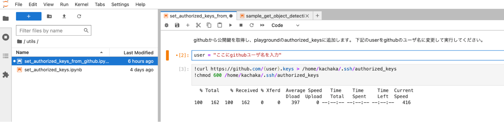

# カチャカ体内 (Playground) で自作のプログラムを動かす

カチャカAPIを使ったプログラムを、カチャカ本体の資源の一部（Playground）を利用して動かすことができます。
Playgroundは、カチャカ体内で動くDockerコンテナで、Ubuntu 22.04 LTSをベースにしています。
Playgroundを使えば、カチャカだけで簡潔するシステムを開発することができます。


## 目次
- [Playgroundの仕様](#playgroundの仕様)
  - [ポート](#ポート)
  - [PlaygroundからカチャカAPIへのアクセス](#playgroundからカチャカapiへのアクセス)
  - [Playgroundのリソース制限](#playgroundのリソース制限)
- [Playgroundにsshでログインする](#playgroundにsshでログインする)
- [Playgroundでサンプルプログラムを実行する](#playgroundでサンプルプログラムを実行する)
- [自作ソフトの自動起動](#自作ソフトの自動起動)
  - [例) 時報のサンプルを自動起動する](#例-時報のサンプルを自動起動する)

## Playgroundの仕様
### ポート
* カチャカの公開ポートの中で、Playgroundに関連するものは以下の通りです。

| ポート番号 | 用途 |
| --- | --- |
| 26400 | KachakaAPI サーバー (gRPC) |
| 26500 | Playground の ssh |
| 26501 | Playground の JupyterLab |
| 26502~26509 | 割り当てなし（自由利用可能） |

### PlaygroundからカチャカAPIへのアクセス
* Playground内部からカチャカAPIを利用する場合、サーバーのアドレスは `100.94.1.1:26400`になります。
  * pythonのkachaka_apiライブラリでは、`KachakaApiClient`のデフォルト値はこのアドレスになっています。

### Playgroundのリソース制限

* ストレージ総計(/home, tmp) 3GB
* メモリー 512MB


## Playgroundにsshでログインする

* jupyterlabのterminalもしくは下記のnotebookいずれかを用いて公開鍵の設定を行います
    * utils/set_authorized_keys.ipynb
    * utils/set_authorized_keys_from_github.ipynb
        * githubに登録している鍵をカチャカでも利用したい場合、こちらのスクリプトが便利です
* utils/set_authorized_keys.ipynbを使用した設定方法
    * 画面左上のFile Browserを選択します。
    * 画面左のファイル一覧からutils → set_authorized_keys.ipynbをダブルクリックします。
    * 画面中央のpublic_keysに公開鍵のテキストを貼り付けます。
    * 上部メニューの「▶▶」ボタンを押します。


* utils/set_authorized_keys_from_github.ipynbを使用した設定方法
    * 画面左上のFile Browserを選択します。
    * 画面左のファイル一覧からutils → set_authorized_keys_from_github.ipynbをダブルクリックします。
    * 画面中央のuserにgithubのユーザ名を入力します。
    * 上部メニューの「▶▶」ボタンを押します



以下のコマンドを実行してPlaygroundにログインします

```bash
ssh -p 26500 -i <登録した公開鍵に対応する秘密鍵> kachaka@<kachakaのIPアドレス>
```

## Playgroundでサンプルプログラムを実行する

* カチャカにsshでログインします。
* 以下のコマンドを実行すると、カチャカが時報を1分間隔で発話します。

```bash
cd ~
git clone https://github.com/pf-robotics/kachaka-api.git
pip install -r /home/kachaka/kachaka-api/python/demos/requirements.txt
python3 /home/kachaka/kachaka-api/python/demos/time_signal.py 100.94.1.1:26400
```

## 自作ソフトの自動起動

* カチャカが再起動したときに自動でプログラムが実行されてほしい場合には、自動起動の機能を使うことができます。
* Playgroundの `/home/kachaka/kachaka_startup.sh` に自動起動したい処理を記述すると、カチャカ起動時に自動的に実行されます。
* ログは `/tmp/kachaka_startup.log` に記録されます
    * python3 を自動起動する際は `-u` オプションを付けると良いです。そうでないと標準出力がバッファリングされてしまい、ログが確認できないことがあります。

### 例) 時報のサンプルを自動起動する

* 例として、カチャカによる時報のサンプルを自動起動する場合を示します。
* `/home/kachaka/kachaka_startup.sh` を以下のように編集します。

```bash
#!/bin/bash

jupyter-lab --port=26501 --ip='0.0.0.0' &

# 以下の行を追加します
python3 -u /home/kachaka/kachaka-api/python/demos/time_signal.py 100.94.1.1:26400 &
```

* 保存後、カチャカを再起動して暫くすると、1分間隔で現在時刻を発話します。
