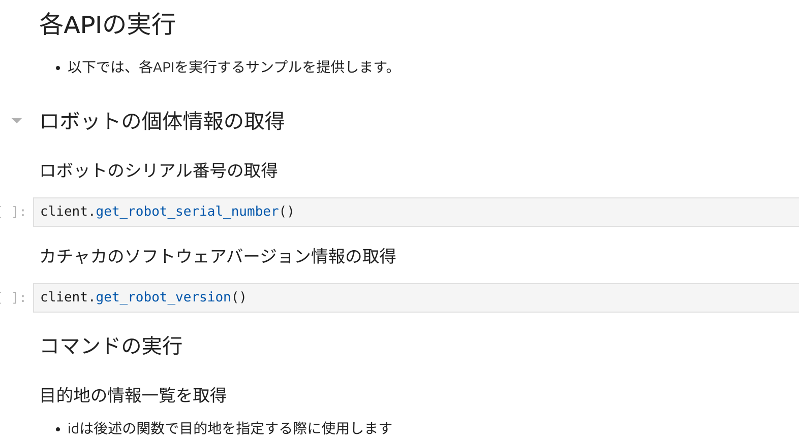

# PythonでカチャカAPIを利用する

* カチャカAPIをPythonで利用しやすいよう `kachaka_api` というPythonライブラリを公式で提供しています。
* [JupyterLabを使ってカチャカAPIを試してみる](./QUICKSTART.md) では、このライブラリを利用しています。このドキュメントでは、ご自身のPCでPythonを実行してカチャカAPIを利用する方法を説明します。

## 目次
- [インストール方法](#インストール方法)
- [基本的な使い方](#基本的な使い方)
- [サンプルコード](#サンプルコード)
- [非同期ライブラリ (aio)](#非同期ライブラリ-aio)


## インストール方法

## pip
以下のコマンドでインストールできます：

```bash
pip install --extra-index-url https://pf-robotics.github.io/kachaka-python-packages/simple kachaka-api
```

## uv
uvの場合は、pyproject.tomlに以下を追加してインストールすることができます。

```toml
[[tool.uv.index]]
url = "https://pf-robotics.github.io/kachaka-python-packages/simple"
```

```bash
uv add kachaka-api
```

## 基本的な使い方
* kachaka_apiライブラリでは、 `KachakaApiClient` クラスが1台のカチャカに対応します。
* ひとつひとつのAPIは、このクラスのメソッドとして実行することができます。

```python
from kachaka_api import KachakaApiClient

client = KachakaApiClient(target="192.168.1.100:26400")

# 状態の取得
current_pose = client.get_robot_pose()
print(f"current pose: {current_pose}")

# 操作や命令
client.speak("カチャカです、よろしくね")
```

* すべてのAPIをひとつずつ説明とともに実行できるようにしたノートブックを公開しています。
    * [kachaka_api_client.ipynb (カチャカAPIドキュメント)](./kachaka_api_client.ipynb)




> [!CAUTION]
> jupyterをご自身のPCで実行する場合は、先頭のセルでKachakaApiClientにカチャカのIPアドレスを指定してください。
> ```diff
> import kachaka_api
> 
> -client = kachaka_api.KachakaApiClient()
> +client = kachaka_api.KachakaApiClient(target="<ご自身のカチャカのIPアドレス>:26400")
> ```

## サンプルコード

* [sample_llm_speak.py](../python/demos/sample_llm_speak.py) ... ChatGPT を使って、コマンド終了時にお喋りをするサンプル
* その他、[python/demos/](../python/demos) 以下に、JupyterLab で利用できる Notebook 形式が多数あります

## 非同期ライブラリ (aio)
> [!NOTE]
> Pythonにまだあまり慣れていない方は、この節は読み飛ばして大丈夫です。

* カチャカAPIは、同期、非同期の2つのインターフェースを用意しています。
    * インターフェースはどちらも基本的に同じで、インポート元をaioに切り替えるだけで、async版のインターフェースを利用できます。

```python
import asyncio

from kachaka_api.aio import KachakaApiClient

async def main() -> None:
    client = KachakaApiClient(target="192.168.1.100:26400")

    # 状態の取得
    current_pose = await client.get_robot_pose()
    print(f"current pose: {current_pose}")

    # 操作や命令
    await client.speak("カチャカです、よろしくね")

if __name__ == "__main__":
    asyncio.run(main())
```


* また非同期ライブラリは、同期ライブラリの機能に加えてcallback登録をサポートしています。
  * callback機能については[sample_llm_speak.py](../python/demos/sample_llm_speak.py)をご参照ください。  

* 非同期も同様にAPIをひとつずつ実行するドキュメントを用意しています。
    * [kachaka_api_client_async.ipynb](./kachaka_api_client_async.ipynb)

