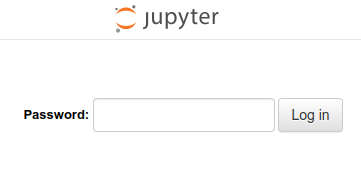
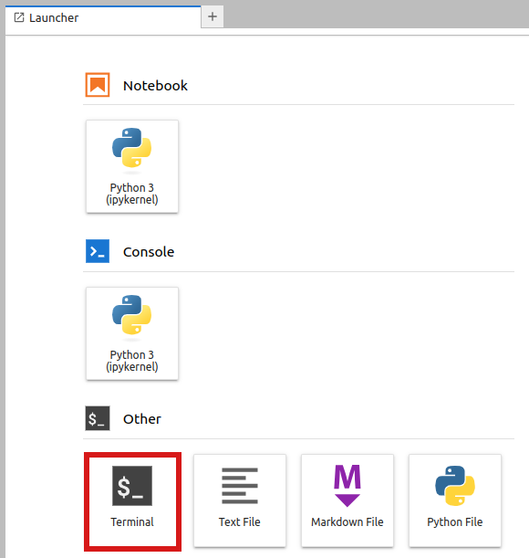
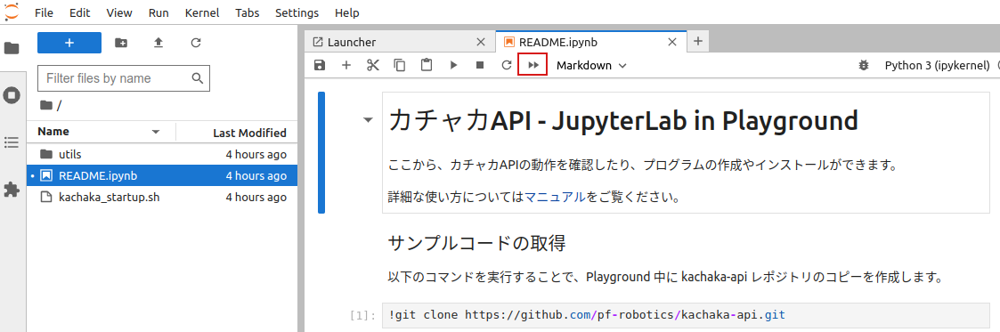
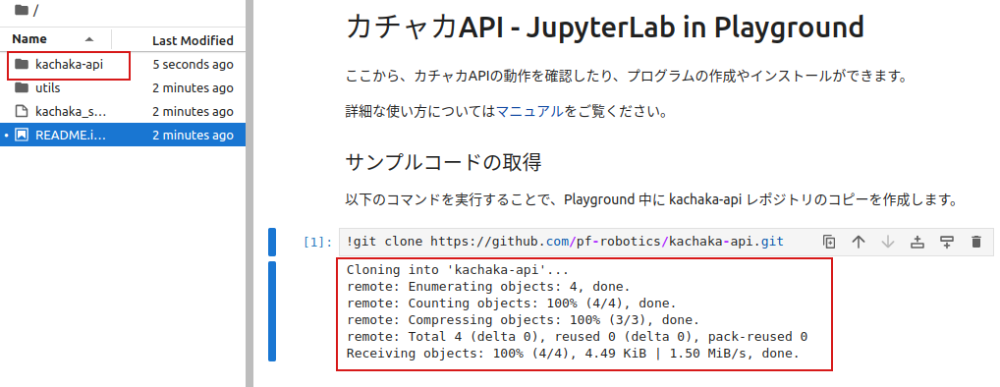
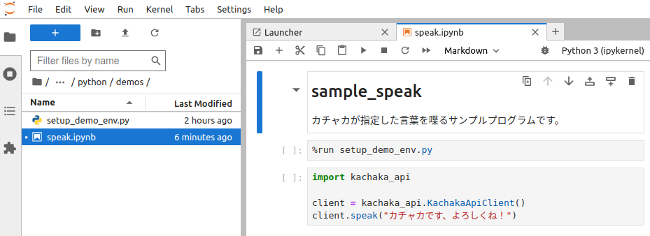
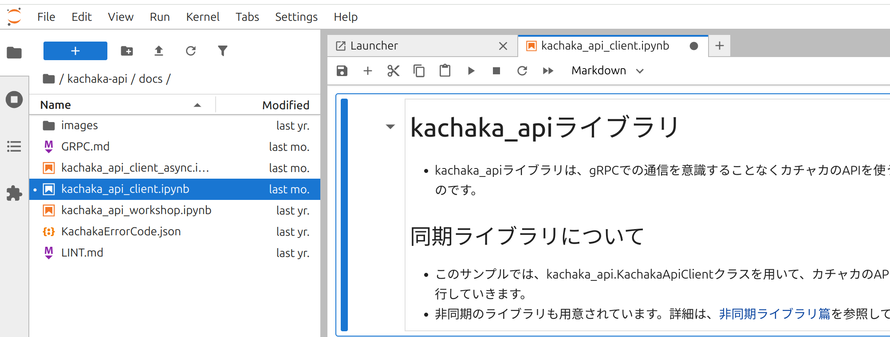

# カチャカAPIを簡単に試してみる (JupyterLab)

カチャカ本体内で動作するJupyterLabを利用することで、OSを問わずWebブラウザのみでカチャカAPI (Python) を実行することができます。カチャカAPIの動作確認やサンプルコードの実行におすすめです。

> [!NOTE]
> 対応ブラウザについては、[JupyterLab公式ドキュメント](https://jupyterlab.readthedocs.io/en/stable/getting_started/installation.html#supported-browsers)をご確認ください。

## 目次
- [JupyterLabを開く](#JupyterLabを開く)
- [サンプルコードを動かしてみる](#サンプルコードを動かしてみる)
    - [サンプルコードのダウンロード](#サンプルコードのダウンロード)
    - [サンプル実行のための依存ライブラリのインストール](#サンプル実行のための依存ライブラリのインストール)
    - [サチャカが発話するサンプルコード](#カチャカが発話するサンプルコード)
- [カチャカAPIのメソッドを試してみる](#カチャカAPIのメソッドを試してみる)

## JupyterLabを開く

1. カチャカのIPアドレスを確認します。
    * スマートフォンアプリの「⚙設定」>「アプリ情報」>「IPアドレス」にカチャカのIPアドレスが記載されています。
2. ブラウザを起動し、以下のURLにアクセスします。
    * `http://<カチャカのIPアドレス>:26501/` (例: `http://192.168.0.20:26501/`)
    
* ログイン画面が表示されるので、以下のパスワードを入力してください。
    * パスワード：kachaka



* パスワードを変更する場合は、以下をご覧ください。
<details>
<summary>パスワードの変更方法</summary>

* パスワードを変更する場合は、まずLauncherから「Terminal」を選択します。



* Terminalで、以下のコマンドを入力します。

```console
$ jupyter lab password
Enter password: <新しいパスワード>
Verify password: <新しいパスワード>
```

* カチャカ本体を再起動すると、新しいパスワードが反映されます。

</details>

## サンプルコードを動かしてみる
### サンプルコードのダウンロード

* 左側のファイル一覧から README.ipynb をダブルクリックしてください。
* 上部メニューの「▶▶」をクリックしてください。



* 以下のダイアログが表示された場合は「Restart」ボタンを押してください。


* サンプルコードのダウンロードが完了すると、以下のようなメッセージが表示され、左側のファイル一覧に kachaka-apiフォルダが作成されます。



### サンプル実行のための依存ライブラリのインストール

サンプルを実行するために必要な依存ライブラリをインストールします。
ダウンロード後初回の一回だけでOKです。

* 左側のファイル一覧からkachaka-api/python/demosフォルダを選択します。
* install_libraries.ipynbをダブルクリックすると、右側にソースコードが表示されます。
* 上部メニューの「▶▶」ボタンを押して実行します。

### カチャカが発話するサンプルコード

* 左側のファイル一覧からkachaka-api/python/demosフォルダを選択します。
* 例えばspeak.ipynbをダブルクリックして開いてみましょう。
* すると、右側にソースコードが表示されます。
* 上部メニューの「▶▶」ボタンを押すと、コード全体が実行されます。



実行結果

「カチャカです、よろしくね」とカチャカが発話します。


## カチャカAPIのメソッドを試してみる
* 今度は、`kachaka-api/docs/kachaka_api_client.ipynb` を開いてみましょう。
* すべてのAPIを1つずつ説明付きで実行するドキュメントになっています。



* 上部メニューで今度は「▶」ボタンを押すと、コードが一つずつ実行されます。
* 一番上から順番に実行して、ひとつひとつのAPIの動作を確認してみましょう。
