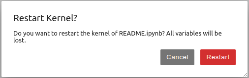

# カチャカAPIを簡単に試してみる (JupyterLab)

カチャカ本体内で動作するJupyterLabを利用することで、OSを問わずWebブラウザのみ用意すれば開発を行うことができます。カチャカAPIの動作確認やサンプルコードの実行におすすめです。

> [!NOTE]
> 対応ブラウザについては、[JupyterLab公式ドキュメント](https://jupyterlab.readthedocs.io/en/stable/getting_started/installation.html#supported-browsers)をご確認ください。

## 目次
- [準備](#準備)
- [パスワードの変更方法](#パスワードの変更方法)
- [サンプルコードのダウンロード](#サンプルコードのダウンロード)
- [依存ライブラリのインストール](#依存ライブラリのインストール)
- [サンプルコードの実行方法](#サンプルコードの実行方法)


## JupyterLabを開く

1. カチャカのIPアドレスを確認します。
    * スマートフォンアプリの「⚙設定」>「アプリ情報」>「IPアドレス」にカチャカのIPアドレスが記載されています。
2. ブラウザを起動し、以下のURLにアクセスします。
    * `http://<カチャカのIPアドレス>:26501/` (例: `http://192.168.1.100:26501/`)
* ログイン画面が表示されるので、以下のパスワードを入力してください。
    * パスワード：kachaka


* パスワードを変更する場合は、以下をご覧ください。
<details>
<summary>パスワードの変更方法</summary>

* パスワードを変更する場合は、まずLauncherから「Terminal」を選択します。


* Terminalで、以下のコマンドを入力します。

```
jupyter lab password
Enter password: <新しいパスワード>
Verify password: <新しいパスワード>
```

* カチャカ本体を再起動すると、新しいパスワードが反映されます。

</details>

### サンプルコードのダウンロード

* 左側のファイル一覧から README.ipynb をダブルクリックしてください。
* 上部メニューの「▶▶」をクリックしてください。


* 以下のダイアログが表示された場合は「Restart」ボタンを押してください。



* サンプルコードのダウンロードが完了すると、以下のようなメッセージが表示され、左側のファイル一覧に kachaka-apiフォルダが作成されます。


### 依存ライブラリのインストール

ダウンロード後初回の一回だけ、下記の手順を実行する必要があります。

* 左側のファイル一覧からkachaka-api → python → demosフォルダを選択します。
* install_libraries.ipynbをダブルクリックすると、右側にソースコードが表示されます。
* 上部メニューの「▶▶」ボタンを押して実行します。

### サンプルコードの実行方法

* 左側のファイル一覧からkachaka-api → python → demosフォルダを選択します。
* speak.ipynbをダブルクリックすると、右側にソースコードが表示されます。
* 上部メニューの「▶▶」ボタンを押して実行します。


実行結果

「カチャカです、よろしくね」とカチャカが発話します。

