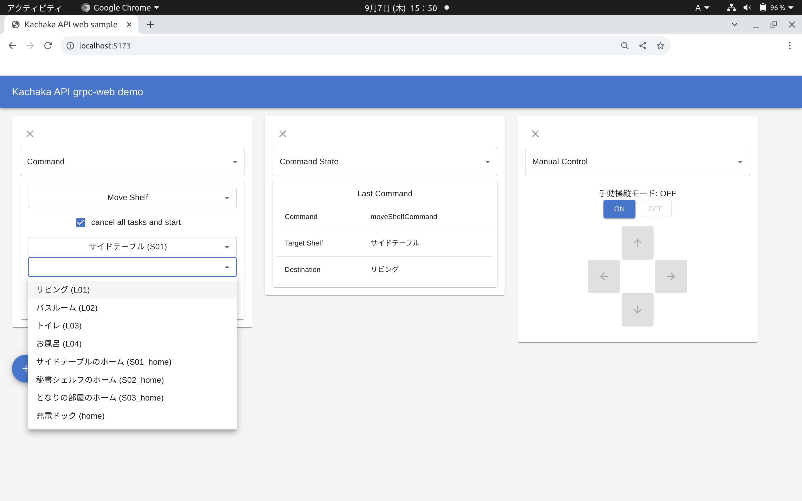

# WebアプリでカチャカAPIを利用する

* ブラウザで動作するwebアプリからも、カチャカAPIを利用することができます。
* ただし、現状webアプリから直接gRPC (HTTP/2) を使うことはできないため、プロキシサーバーを立ててgrpc-webのプロトコルで通信する必要があります。
  * gRPCの通信に必要なHTTP/2の通信をjavascriptから自由に取り扱うことが可能な環境は限られており、HTTP/1.1で表現するgrpc-webプロトコルが必要です。
* ここでは、プロキシをenvoyを使って立てる方法を紹介し、webアプリからカチャカAPIを利用するサンプルをご紹介します。

## 目次
- [プロキシサーバ](#プロキシサーバ)
- [Webサンプル(React + TypeScript)](#webサンプル-react--typescript)


## プロキシサーバ

* プロキシサーバーの起動

```bash
$ ./tools/web_proxy/start_proxy_remote.sh <カチャカのIPアドレス>
```

* プロキシサーバーは、webアプリからアクセスでき、またカチャカにアクセスできるネットワーク接続を備えた場所であればどこで起動しても構いません。
* このスクリプトでは、`localhost:50000`にプロキシサーバを立てる例を示しています。

## Webサンプル (React + TypeScript)



* Reactを利用して、カチャカAPIと連携するwebアプリのサンプルです。
* プラスボタンを押すとパネルが追加され、パネルの種類を選ぶと対応するAPIを利用した表示がなされるデモです。
* 起動するには、以下のコマンドを実行してください。

```bash
$ cd web/demos/kachaka_api_web_sample
$ npm install
$ npm run dev
```

* npmの環境がない方は、適宜インストール作業を行って下さい。
* 以下にインストール方法の例を示します。
  * aptでインストールされるnpmは古い可能性があります。nで最新のstableをインストールすることを推奨します。
  * サンプルは nodejs v18.17.1、npm 9.6.7 で動作を確認しています。

```bash
$ sudo apt install nodejs npm
$ sudo npm install -g n
$ sudo n stable
```

### カチャカAPIとReact hook
* [Cursorによるロングポーリング](./GRPC.md#cursorによるロングポーリング)で紹介していますが、カチャカAPIではcursorという概念を用いることで、無駄のない値の更新を行っています。
* React hookでは、このカーソルの更新をつかってGet系のAPIを呼び出し、レスポンスが返ってくるたびにstateを更新することで、値が変更されるたびに最低限の計算でレンダリングを行うことができます。
* 具体的な処理については `web/demos/kachaka_api_web_sample/src/kachakaApi.ts` を参照してください。
