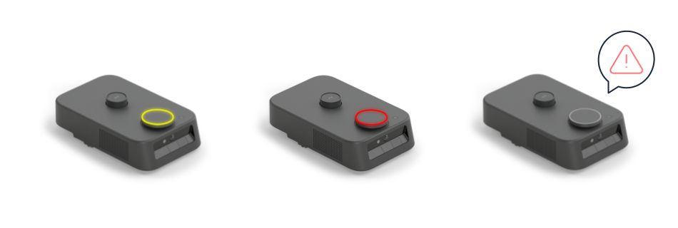

# エラー状態の検知・ハンドリング

カチャカが何かの動作に失敗したり、機器の不具合が生じたときなどには、カチャカAPI経由でそのエラー情報が伝達されます。こうして伝達されるエラーには、かならずエラーコード(番号)が割り当てられています。このエラー番号を参照することで、どんなエラーが起きているのか、どう対処すればいいのかを知ることができます。



## エラー発生の系統
カチャカがエラーを発行するタイミングは大きくわけて2つあります。

### 同期エラー
同期エラーとは、API経由でユーザーがカチャカに対してなにかを指令した際に、その返答として返ってくるエラーのことです。たとえば、音量を指定しようとしてSetVolume APIを呼び出したときに、その設定しようとしている音量が範囲外の値の場合には、レスポンスにそのエラー情報が含まれて返ってきます。

このような同期のAPIには、レスポンスに以下のResultメッセージが含まれています。
`success`がfalseの場合にはエラーを示しており、`error_code`にエラーコードが含まれています。

```protobuf
message Result {
  bool success = 1;
  int32 error_code = 3;
}
```

たとえば音量を設定するSetVolume APIは、以下のようなレスポンスになっています。

```protobuf
message SetSpeakerVolumeResponse {
  Result result = 1;
}
```


### 非同期エラー
非同期エラーとは、なにかのAPI呼び出しとは関係なく発生しているエラーのことです。
たとえば、「一時停止している」「障害物があって動けない」といったものから、カメラの不調など機器的な不具合まで、幅広いカチャカの状態について扱います。
このような非同期エラーは、`GetError` APIを呼び出すことで取得できます。

```protobuf
message GetErrorResponse {
  Metadata metadata = 1;
  repeated int32 error_codes = 2;
}
```

レスポンスは上の通りで、`error_codes`という配列が現在のエラー状態を示すエラーコードをすべて含んでいます。
一時停止のような持続的な状態については、それが解消されるまで含まれます。
一方、「障害物があって動けない」といったようなイベント的なエラーについては、そのエラーが発生した時点で含まれます。

## エラーの種類
エラーコードとその意味の対応表はロボットがマスターデータを持っており、`GetRobotErrorCodeJson` APIで取得できます。
原則として番号が別の意味を持つようになることはなく、バージョンアップに対しても一貫性を持ちます。(同じ系のエラーが細分化されることはあります)

### エラーコードの抜粋
部分的に抜粋すると、以下のようになっています。たとえば一時停止状態かどうかは、21051がエラーとして含まれているかどうかで取得することができます。

<details>
<summary>エラーコードの抜粋</summary>

```json
[
  ...
  {
    "code": 14605,
    "title": "充電ドック上に家具を置くことはできません",
    "description": "",
    "title_en": "Furniture cannot be placed on the charging dock",
    "description_en": "",
    "error_type": "Error",
    "ref_url": ""
  },
  {
    "code": 14606,
    "title": "家具を載せていません",
    "description": "",
    "title_en": "Kachaka is not docked with a furniture",
    "description_en": "",
    "error_type": "Error",
    "ref_url": ""
  },
  ...
  {
    "code": 21051,
    "title": "一時停止しています",
    "description": "電源ボタンを押して解除してください。",
    "title_en": "Kachaka is paused",
    "description_en": "Please press the power button to resume from the pause state.",
    "error_type": "Warn",
    "ref_url": ""
  },
  {
    "code": 21052,
    "title": "段差を検知しました",
    "description": "段差を検知したため、一時停止しました。段差のない場所にカチャカを移動した上で、電源ボタンを押して解除してください。",
    "title_en": "Step detected",
    "description_en": "Kachaka has paused because a step was detected. Please move Kachaka to a flat surface and press the power button to resume from the pause state.",
    "error_type": "Error",
    "ref_url": ""
  }, 
  ...
``` 
</details>

### エラーの深刻さ
上で取得されるjsonに、"error_type"というフィールドが含まれています。これはエラーの深刻さを示しており、同期エラーと非同期エラーでそれぞれ以下の種類があります。

#### 同期エラー（API呼び出し時）
| エラータイプ | 説明 |
|------------|------|
| Ignore | 成功ではないが、無視できる程度 |
| Warn | 一応伝えておいたほうがいい程度 |
| Error | 失敗だが、再度試すと成功する可能性がある |
| Bug | 異常系の発生 (アップデートが必要) |

#### 非同期エラー（ロボットの状態）
| エラータイプ | 説明 | LED |
|------------|------|------|
| Warn | 伝えておいたほうがいい程度の情報 |  |
| Error | 再起動以外で復帰可能 | 黄色 |
| Recoverable | 一定時間で復帰可能 | 白色が回転 |
| Fatal | 再起動で復帰可能 | 赤色 |
| CallForSupport | 深刻な故障 (カスタマーサポートにご連絡ください) | 赤色点滅 |
