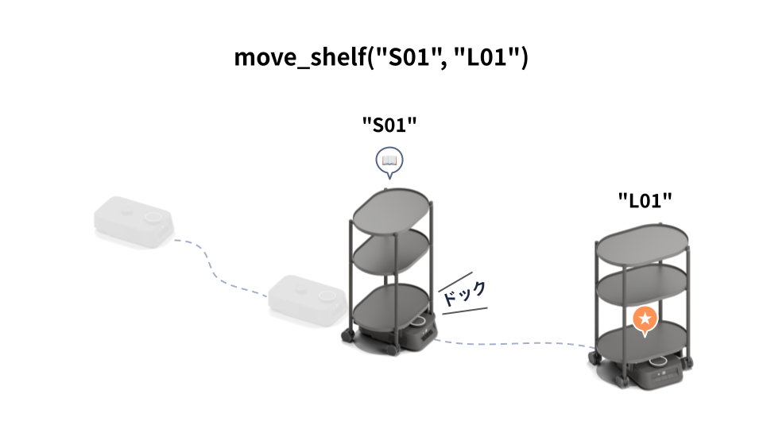
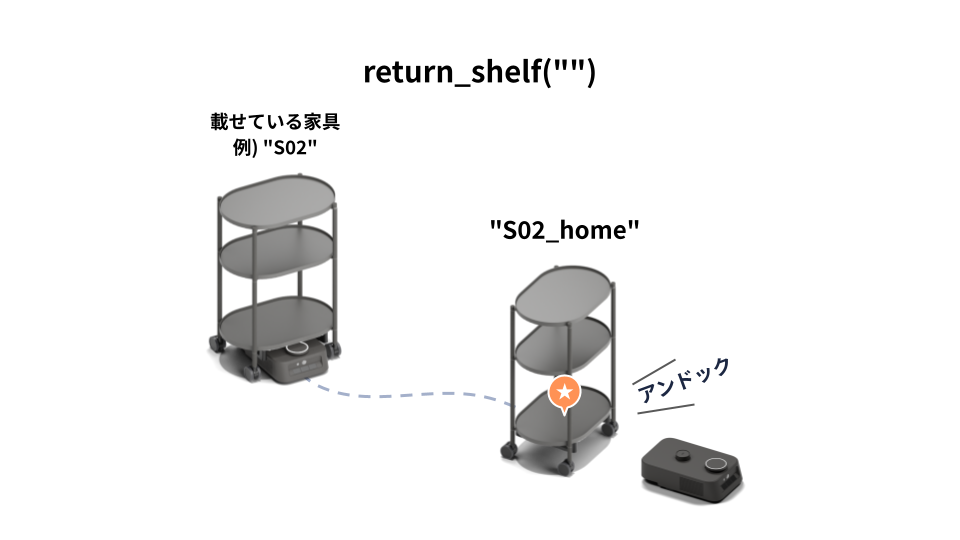
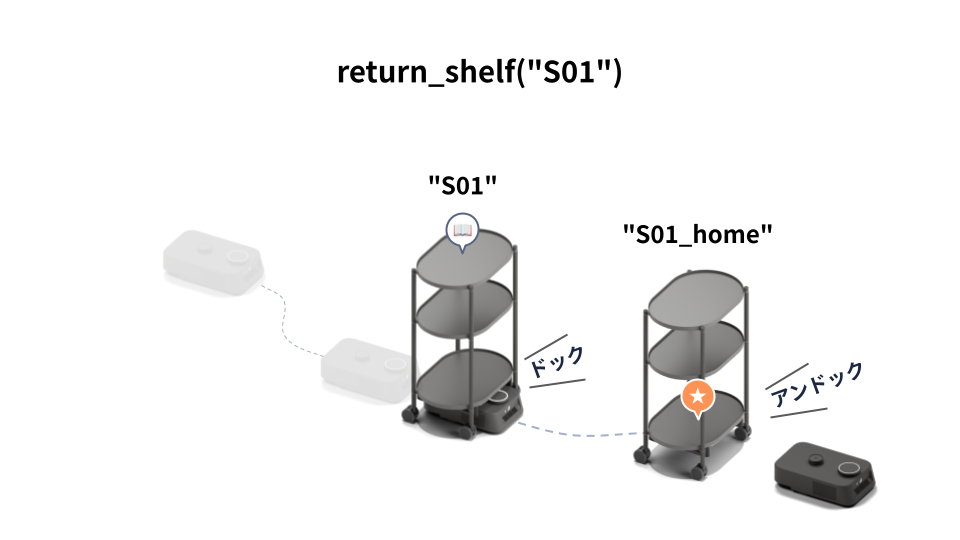
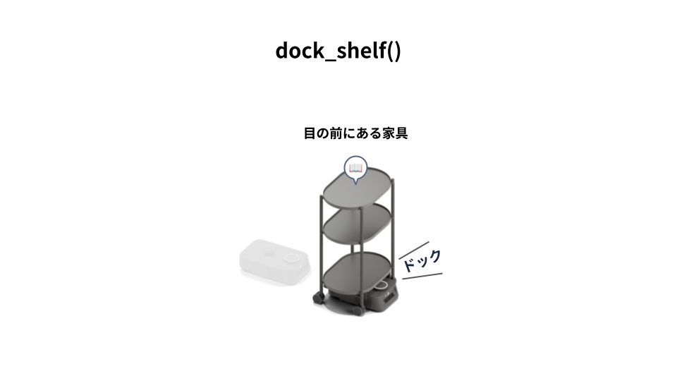
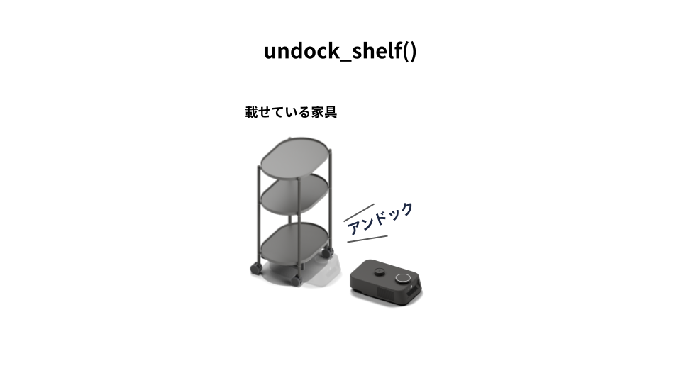
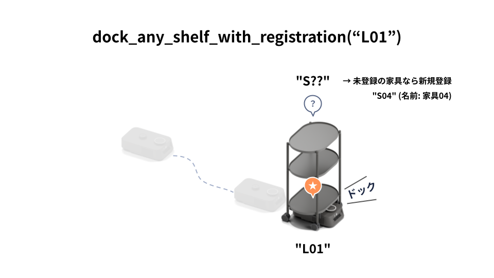

# 家具の移動

## 基本のAPI
家具の移動を行うAPIは複数あります。基本となるのは、以下の4つです。

|      API      |              役割                    |
|      ---      |              ---                    |
| `move_shelf`  | 指定した家具を指定した場所に移動する      |
| `return_shelf`| 指定した家具を家具のホームに片付ける      |
| `dock_shelf`  | カチャカの正面にある家具をドッキングする  |
| `undock_shelf`| 載せている家具をそこに置いて脱出する      |

### move_shelf
* 呼び出し: `move_shelf(shelf_id, location_id)`
* 家具(ID: shelf_id)を指定した場所(ID: location_id)に移動します。

### return_shelf
* 呼び出し: `return_shelf(shelf_id)`
* 家具(ID: shelf_id)を家具のホームに片付けます。

* 現在載せている家具を片付ける場合は、shelf_idを空にして `return_shelf("")` とします。

* 現在載せていない家具を指定すると、その家具の場所に行ってドッキングし、片付けます。

### dock_shelf
* 呼び出し: `dock_shelf()`
* カチャカの正面にある家具をドッキングします。

### undock_shelf
* 呼び出し: `undock_shelf()`
* 載せている家具をそこに置き、家具下から脱出します。前後どちらに抜けるかは、空き具合によって判断されます。

## 高度なAPI
* 加えて、より高度なユースケースに対応するために、以下のAPIが提供されています。

|                                       |                                                   |
|                 ---                   |                        ---                        |
| `dock_any_shelf_with_registration`    | 指定した場所に登録されている家具をドッキングする  |

### dock_any_shelf_with_registration

* 呼び出し: `dock_any_shelf_with_registration(location_id)`
* 指定した場所に置かれている任意の家具をドッキングします。
* **家具が未登録の場合は、ドッキング後に家具を登録します。**

