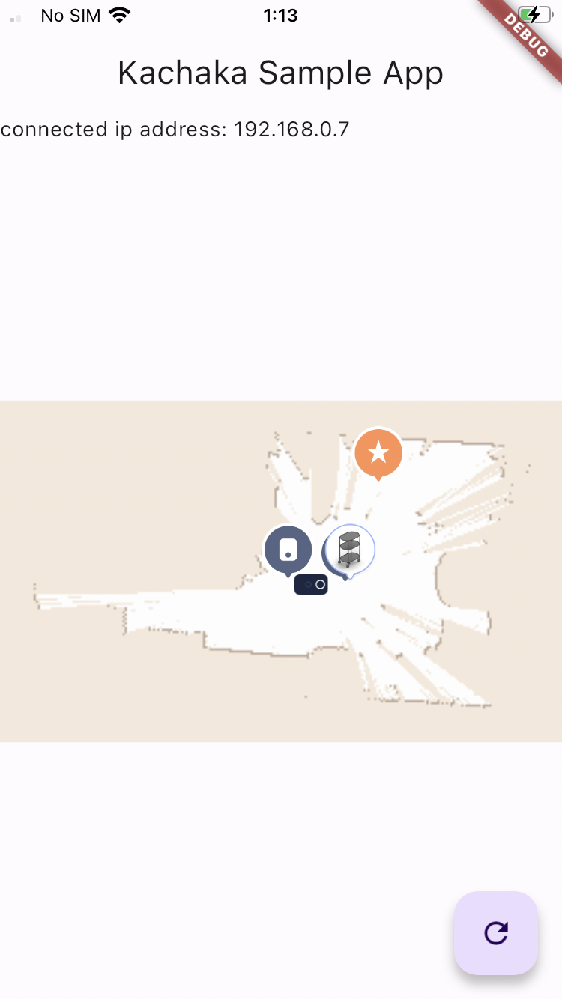

# kachaka_api_flutter_sample



kachaka_api_flutter_sample is a Flutter application based on [kachaka-api](https://github.com/pf-robotics/kachaka-api) 🎉🎉🎉.

## Usage

Make sure you have Flutter installed on your local machine. For more instructions on how to install flutter, look [here](https://docs.flutter.dev/get-started/install).

```
git clone git@github.com:pf-robotics/kachaka-api.git
cd kachaka-api/flutter/demos/kachaka_api_flutter_sample

# Replace "xxx.xxx.xx.xx" with Kachaka's IP address
flutter run --dart-define=IP_ADDRESS="xxx.xxx.xx.xx"
```

Currently, iOS and Android are supported. This app is verfied to work with Flutter version 3.13.2.

## Overview

The app consists of three main features:

- gRPC-based Connection to "Kachaka": This app establishes a connection to "Kachaka" using gRPC and synchronizes smartphone data through cursor-based polling.

- Map Display: It displays "Kachaka", furniture, and destinations on a map, providing a visual representation of these elements.

- Action Execution: Users can perform actions by tapping on pins on the map. This includes moving furniture and navigating to specific destinations.
