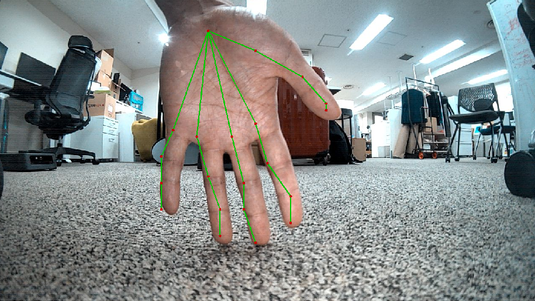

# Vision Example

# Overview

* This is an example that uses front RGB camera to detect hand pose.

# Building

* Download model and config file from the internet.

```bash
cd ~/kachaka-api/ros2/demos/kachaka_vision/config
# sometimes the following link is not available, then please see and find the mirror link in https://github.com/CMU-Perceptual-Computing-Lab/openpose/issues/1567
wget http://posefs1.perception.cs.cmu.edu/OpenPose/models/hand/pose_iter_102000.caffemodel
wget https://raw.githubusercontent.com/CMU-Perceptual-Computing-Lab/openpose/master/models/hand/pose_deploy.prototxt
```

* Copy the necessary folders to workspace and build the project.

```bash
mkidr -p ~/ros2_ws/src
cd ~/ros2_ws/src
cp -r ~/kachaka-api/ros2/demos/kachaka_vision .

cd ~/ros2_ws
colcon build
```

# Execution

* Open another terminal and start the ROS2 bridge.

```bash
cd ~/kachaka-api/ros2_bridge
./start_bridge.sh <Kachaka's IP>

```

* Next, run the following command.

```bash
cd ~/ros2_ws
source install/setup.bash
ros2 launch kachaka_vision hand_recognition_launch.py
```

* Now, let's check the output image by the following command on another terminal, then put your hand on the front camera.

```bash
ros2 run rqt_image_view rqt_image_view /hand_recognition_node/output_image
```


